# About List Interface:
- A list in Java is a collection for storing elements in sequential order.
- Available in java.util package.
- public interface List<E> extends Collection<E>
## When to Use List?
- When we want to preserve my insertion order then we should go for list.
## About List (I)
- Duplicate elements are allowed (mutiple)
- null elements are allowed. (mutiple)
- It maintains insertion order. i.e. List can preserve the insertion order by using the index.
- Provide listIterator for iteration of element.
- In the list, we can add an element at any position. 
- Implementation classes are ArrayList, LinkedList, Vector, and Stack.
-  Various methods
    -  boolean add(Object o): 
    -  void add(int index, Object o):
    -  boolean addAll(Collection c): 
    - ListIterator listIterator()
    - etc... 

# About ArrayList
- Implementation class of List(I)
- Duplicate elements: Duplicate elements are allowed in the array list.
- Null elements: Any number of null elements can be added to ArrayList.
- Insertion order: It maintains the insertion order in Java. That is insertion order is preserved.
- Heterogeneous objects: Heterogeneous objects are allowed everywhere except TreeSet and TreeMap. Heterogeneous means different elements.
- Resizable-array: ArrayList is a resizable array or growable array that means the size of ArrayList can increase or decrease in size at runtime.
- Index-based structure: It uses an index-based structure in java.
- Synchronized: ArrayList is not synchronized. That means multiple threads can use the same ArrayList objects simultaneously.
- Implement Random Access, Serializable and Cloneble (I).
    - All are marker (I)
    - Random Access 
        -  we can access any random element at the same speed
        - Now assume that first element x can be accessed within only 1 sec.  Due to the implementation of random access interface, the 10th element and 1st crore element can also be accessed within 1 sec.
## About Advantage:
-  Dynamic size:
-  Easy to use : ArrayList is easy to use and provides a variety of methods for adding, removing, and accessing elements.
-   Type safety: ArrayList provides type-safety in Java, meaning that we can only add elements of the same data type.
## About disadvantage:
-  Performance: In ArrayList, manipulation is slow because if any element is removed from ArrayList, a lot of shifting takes place.
- Not thread-safe
- Not suitable for primitive types: 
## About Capacity
- ArrayList al = new ArrayList();
- It creates an empty ArrayList with a default initial capacity of 10.
- Once ArrayList is reached its maximum capacity, the ArrayList class automatically creates a new array with a larger capacity.
- New capacity = (current capacity*3/2) + 1 = 10*3/2 + 1 = 16

# About Vector
- Java Vector class is similar to ArrayList class with two main differences.
    - Vector is synchronized. It is used for thread safety.
    - It contains many legacy methods that are not now a part of the collections framework.
- The underlying Data structure for vector class is the resizable array or growable array.
- Duplicate elements are allowed
- Null elements are allowed
- insertion order is preserved
- Heterogeneous elements are allowed 
- methods of vector are synchronized. Two threads cannot access the same vector object at the same time
- Because of thread safety performance is poor.
- Vector is the best choice if the frequent operation is retrieval 
- Vector is created with an initial capacity of 10 but its size is increased by 100%.
    - i.e when vector reaches to it's full capacity it's new capacity will be doble of it's previous one.
    - eg initial capacity is 10 then new will be 20
# Difference between ArrayList and Vector in Java
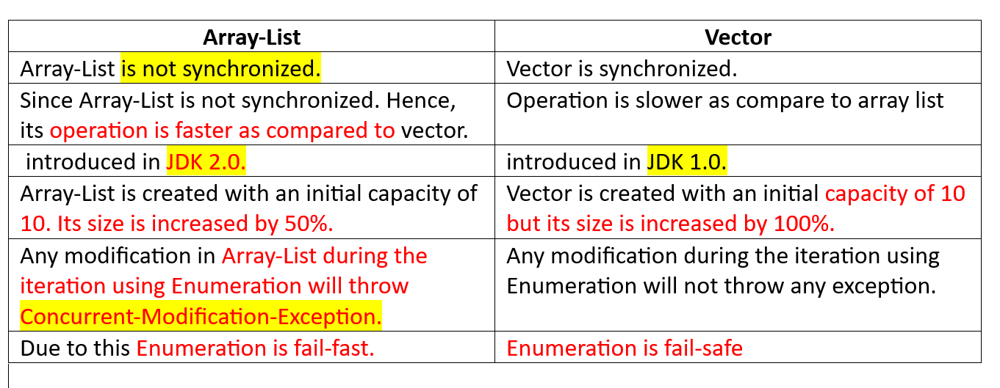
# About Stack
- stack is a data structure that stores data in last-in, first-out fashion.
- This means an element that is stored as a last element into the stack, will be the first element to be removed from the stack.
- Only the top element on the stack is accessible at a given time.
- When an element (object) is inserted into the stack, it is called push operation.
- When an element is removed from the stack, it is called pop operation.
- Insertion and deletion of elements take place only from one side of the stack, traditionally called the top of the stack. 
- eg a stack of books, a stack of dvd
- Java Stack class extends vector class 
-  It implements List interface, RandomAccess , Serializable and Cloneable interfaces.
- Stack class is synchronized. That means it is thread-safe.
- Null elements are allowed into the stack.
- Duplicate elements are allowed into the stack.
-  E peek(): This method is used to retrieve the top-most element from the stack without removing it.
- Stack() constructor
# About Linked List
- Duplicate element are allowed.
- Null elements can be added 
- Heterogeneous elements are allowed
-  Java LinkedList is not synchronized. Therefore, It is not thread-safe. Since LinkedList is not synchronized. Hence, its operation is faster.
- Insertion and removal of elements in the LinkedList are fast because, in the linked list, there is no shifting of elements after each adding and removal.
- LinkedList is the best choice if your frequent operation is insertion or deletion in the middle
- Retrieval (getting) of elements is very slow in LinkedList because it traverses from the beginning or ending to reach the element.
- The underlying data structure of LinkedList is a doubly LinkedList data structure.
    - A doubly linked list consists of a group of nodes
    - Each node contains three fields: a data field that contains data stored in the node, left and right fields contain references or pointers that point to the previous and next nodes in the list.

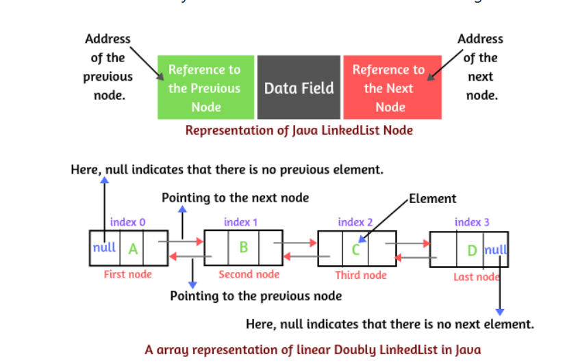

- Java LinkedList class implements List, Deque, and Queue interfaces. It extends AbstractSequentialList. It also implements marker interfaces such as serializable and cloneable but does not implement random access interface.

# ***  ***About Method Overridding***
- When the superclass method is available to subclass by default through inheritance
    - and subclass does not satisfy with superclass implementation, 
    - then the subclass is allowed to redefine that method on its requirement. 
    - This feature is called method overriding in Java.
- ***To override a method*** in a subclass,
    - the method must be defined in the subclass using the ***same signature*** 
    - and ***same return type*** as in its superclass
- Method overriding occurs only when the signatures of the super and subclasses methods are identical.
    - If they are not, then both methods are simply overloaded methods.

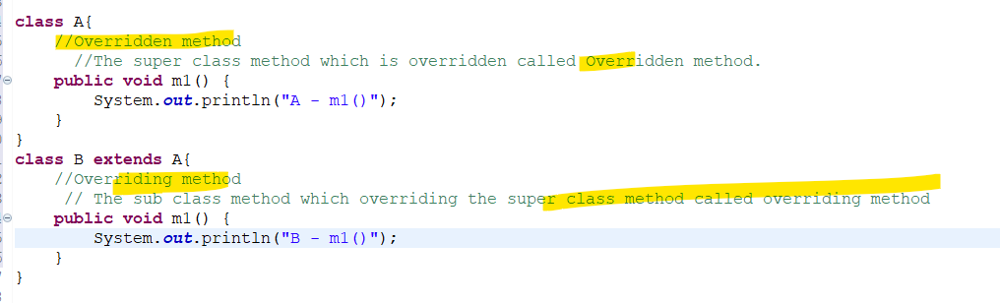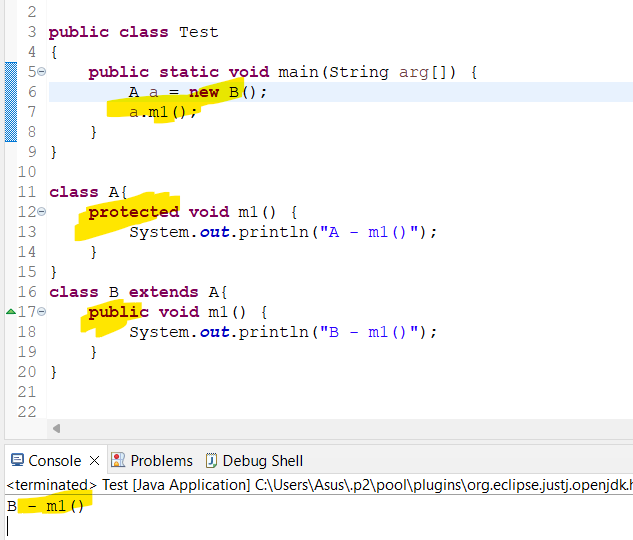
## About concept of oop's
- as per the object-oriented programming concept, the best practice is that class should not be opened for modification.
- if you want to modify the existing functionality of the class, you should not disturb the existing class.
    - You should always write a subclass of the existing class and add new functionality in subclass like this:
## Features
- supports the runtime polymorphism.
- Only the instance method can be overridden in Java.
- An instance variable can never be overridden in Java.
- The overriding method can not be more restrictive access modifiers than the overridden method of the superclass.
- Overriding concept is not applicable for private, final, static, and main method in Java.
- From Java 5 onwards, method overriding can also be done by changing the covariant return type only.
- Overriding method cannot throw any checked exception.Since it is resolved at runtime and not on compile time so Unchecked exception will be thrown if needed.
## About covariant return type
- Covariant return, means that when one overrides a method, the return type of the overriding method is allowed to be a subtype of the overridden method's return type.
    - Imagine a superclass Animal with a method makeSound() that returns String.
    -  A subclass Dog could override makeSound() and return a more specific type like String (e.g. "Woof!"). 
- To clarify this with an example, a common case is Object.clone() - which is declared to return a type of Object.
- You could override this in your own class as follows:

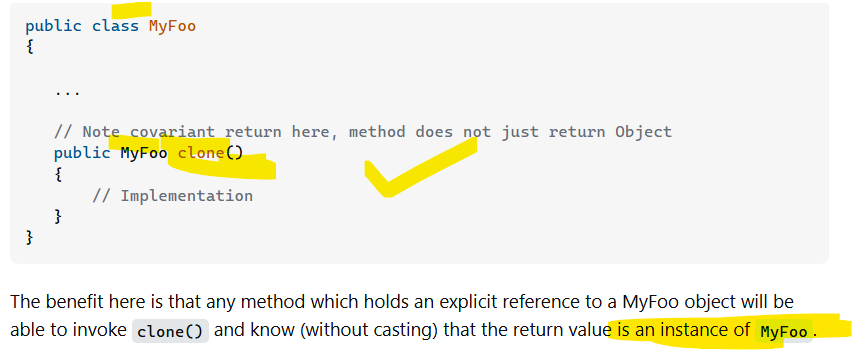
- Clone method retrun type is objct but if you override it properly it return type is MyFoo. This is more specific covarient return type.
## Method Overriding rules
- Subclass method name must be the same as the superclass method name.
- the method signature must be the same or matched.
    - i.e  method name and argument types must be matched.
- Must be Is-A relationship (Inheritance).
- Subclass method’s return type must be the same as the superclass method return type. 
    - But onwards 1.5 version covarient return type is allowed.
- Overriding method cannot throw new or broader checked exceptions. 
    -  But, it can throw fewer or narrower checked exceptions or any unchecked exception.
- Subclass method’s access modifier must be the same or less than the superclass method access modifier.

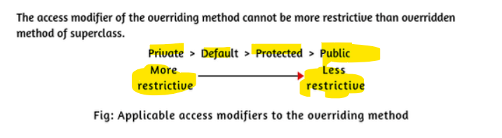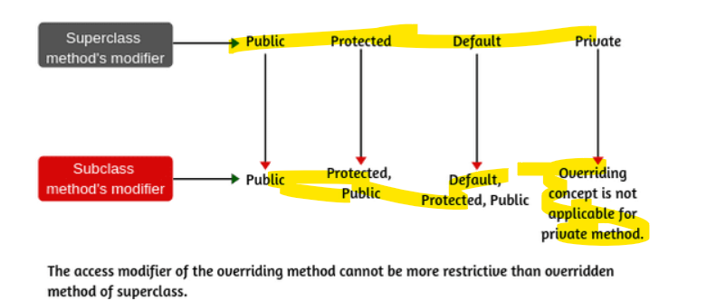
## Why do We Need to Create Subclass in Java?
- For example, a student has properties like age and location
    - But in the future, if we get a new requirement to add one more property “address” for that student,
- we should make a subclass of that class and add a new property address in the subclass.
- To override or change the existing functionality of the superclass method. We create subclass
## What is @Override Annotation in Java?
- Introduced in 1.5 version
- via this compiler checks all the rules of overridding.
    - Method name same.
    -  Parameters are the same.
    - Superclass and subclass relation.

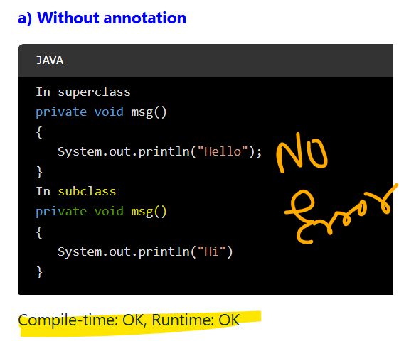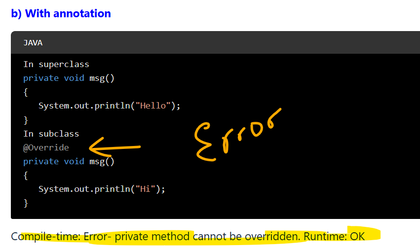
## When to Use @Override Annotation in Java?
- Used for  readability and understanding.
- It will follow all rules for overriding.
- Other person can understand.
## Who (Java compiler or JVM) decides Which Method is to be Executed?
- In case of method overriding the JVM decide which method is to be executed.
- JVM decides method call depending on the runtime object of the class.
- At runtime, JVM will check that the reference variable is pointing to the which class object? parent class object or child class object.
- if refrence pointing to parent class object parent class method is called and vice versa.
- method resolution is always based on runtime object
- Therefore, it is also called runtime polymorphism or dynamic polymorphism, or late binding in java.

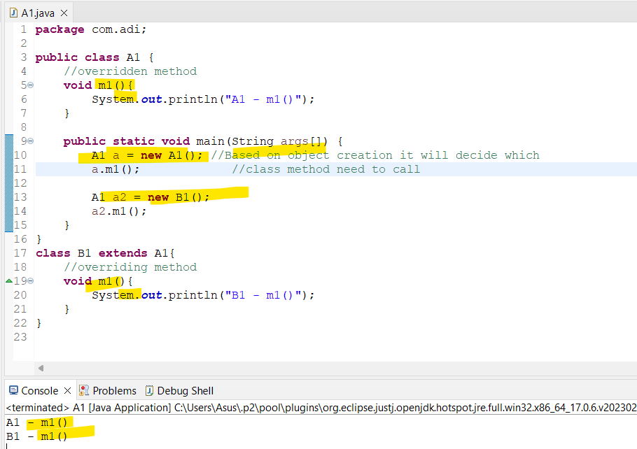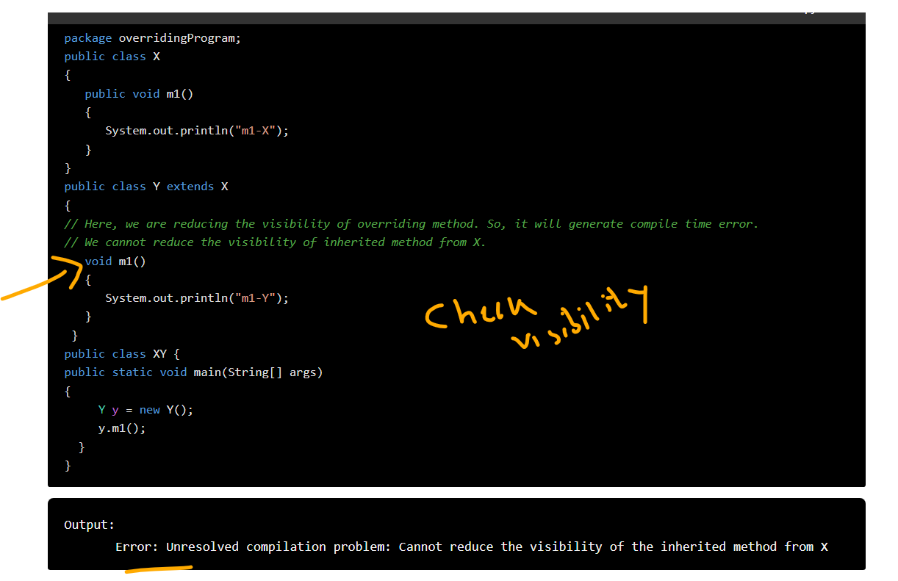
## Why cannot Private Method be Overridden?
-  it will not be visible to the subclass.
- Whatever methods we writing in the subclass will be treated as a new method but not an overridden method.

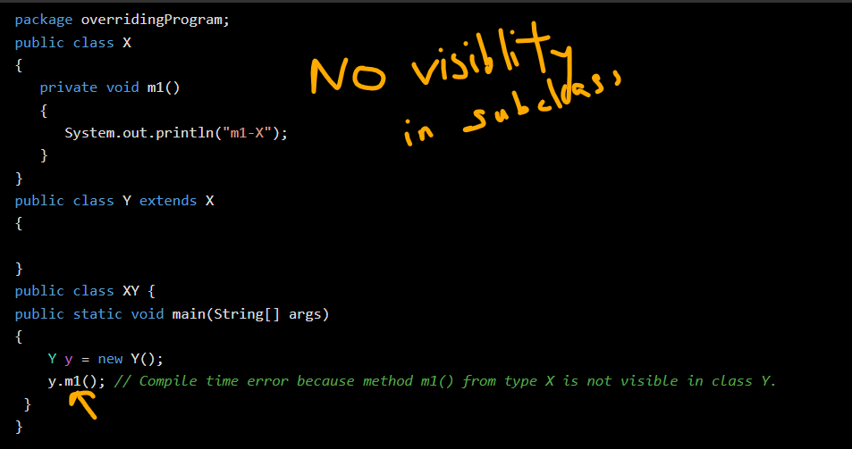
## Can We Stop Method Overriding in Java?
- Yes, we can stop method overriding by declaring method as final. 

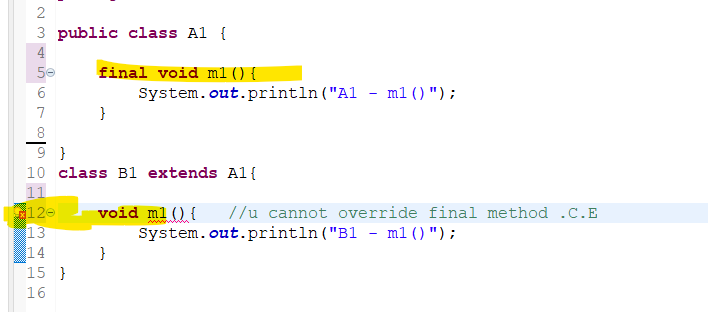
## Advantages of Using Method Overriding in Java
- It is used to achieve runtime polymorphism in Java.
- It is used to change the existing functionality of the superclass method.
- Method overriding allows us to extend the functionality of a superclass without altering its original implementation. We can add a new feature or property in subclass.
# *** ***About Method hiding***
- A static method (class method) cannot be overridden in Java. 
- But if a static method defined in the parent class is redefined in a child class, 
    - then the child class’s method hides the method defined in the parent class.
- This mechanism is called method hiding in Java or function hiding. 
## Rules of Method Hiding in Java
- All the rules of method hiding are exactly the same as overriding, 
-  except one rule. Both parent and child class methods must be static.
## Features of Method Hiding in Java
- Method hiding is also known as compile-time polymorphism
    - because the compiler is responsible for resolving method resolution based on the reference type.
- It is also known as static polymorphism or early binding.
-  In method hiding, method call is always resolved by Java compiler based on the reference type.
    - There is no role of runtime polymorphism in method hiding in Java.

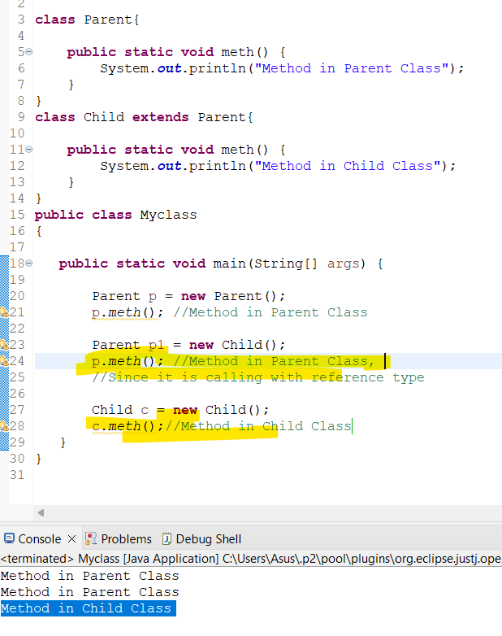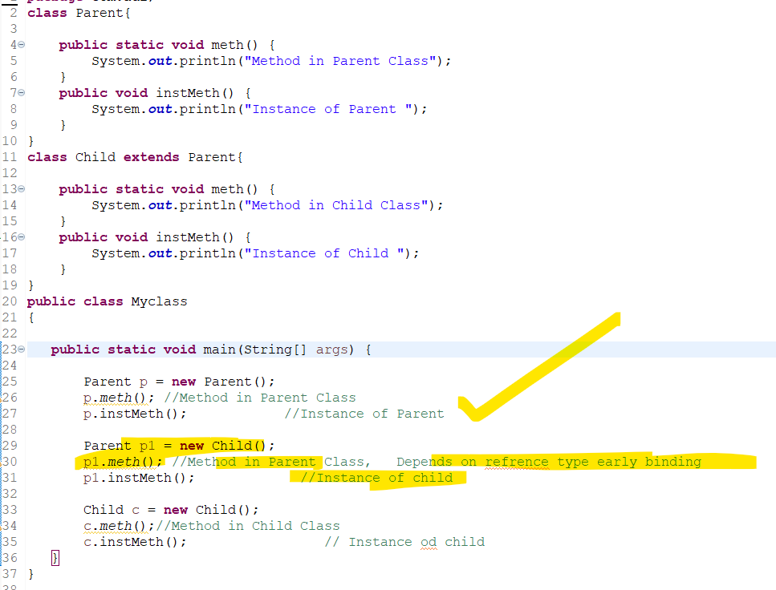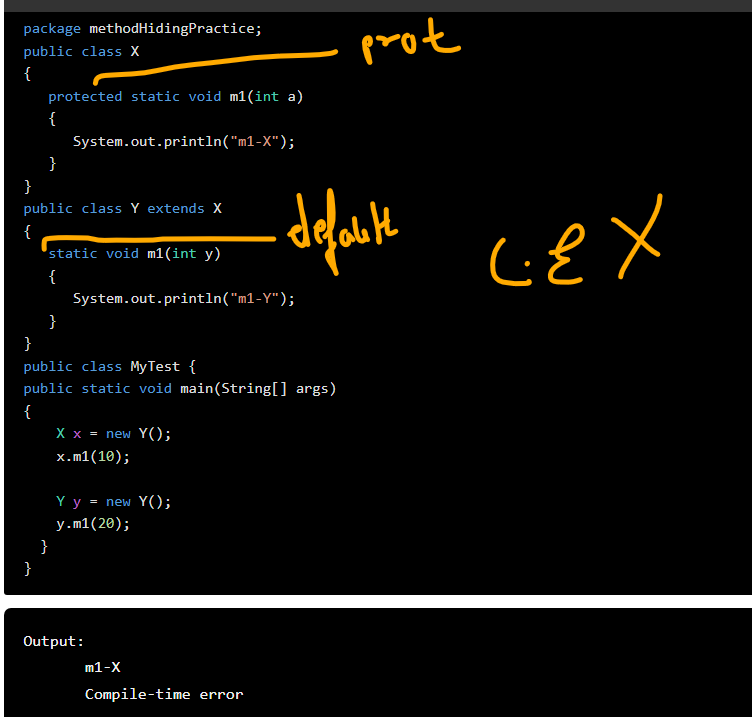
- In the method overriding, the method call is resolved by JVM based on the runtime object (new Object).
-  In the method hiding, the method call is resolved by the Java compiler based on reference type (Object obj).
## Difference between Method Hiding and Method Overriding
### Method Hiding
- In method hiding, both parent and child class methods should be static
- Compiler is responsible for method resolution based on reference type
- Method hiding is also known as compile-time polymorphism, static polymorphism, or early binding, 
### Method Overriding
- whereas in overriding, both parent and child class methods should be non-static.
-  JVM is always responsible for method resolution based on runtime object.
- whereas method overriding is also known as runtime polymorphism, dynamic polymorphism, or late binding.
# *** ***Variable Hiding***
- When a variable defined in the parent class is redefined with the same name in a child class
    - the child class’s variable hides variable defined in the parent class. 
    - This mechanism is called variable hiding in Java.
- It can be achieved by declaring a variable in the child class that must be the same name and type of an inherited variable from its parent class.
- Variable hiding is useful when you want to reuse the same variable name in the subclass.

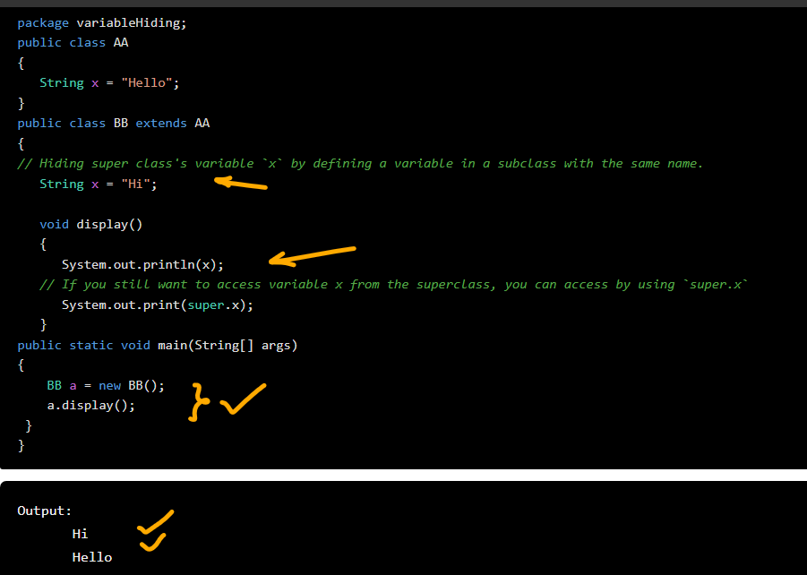
## Catch
- When an instance variable in a child class has the same name as an instance variable in a parent class,
    - the instance variable is chosen from the ***reference type***.

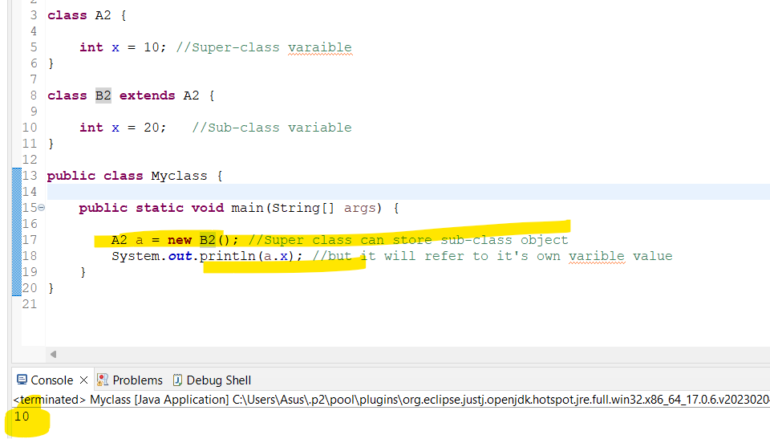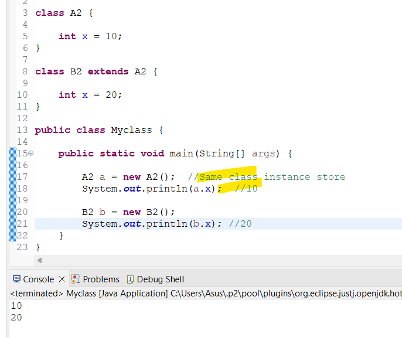
## Catch-2
-  when we declare a local variable in a method with the same name as an instance variable
- then the local variable hides instance variable.
- This concept is useful if you want to reflect the change made over to the instance variable.

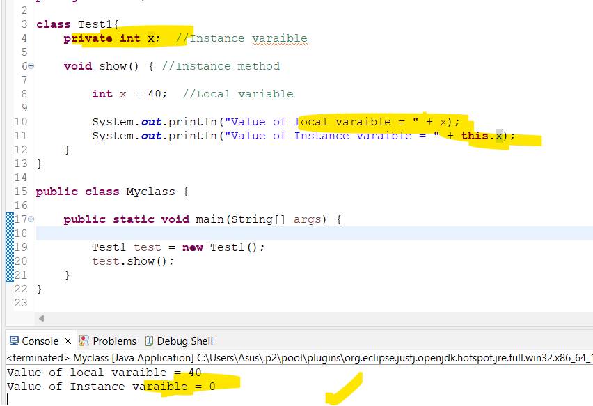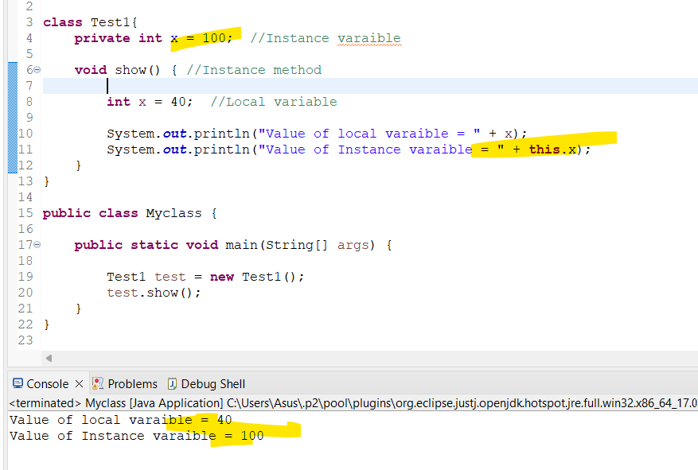

