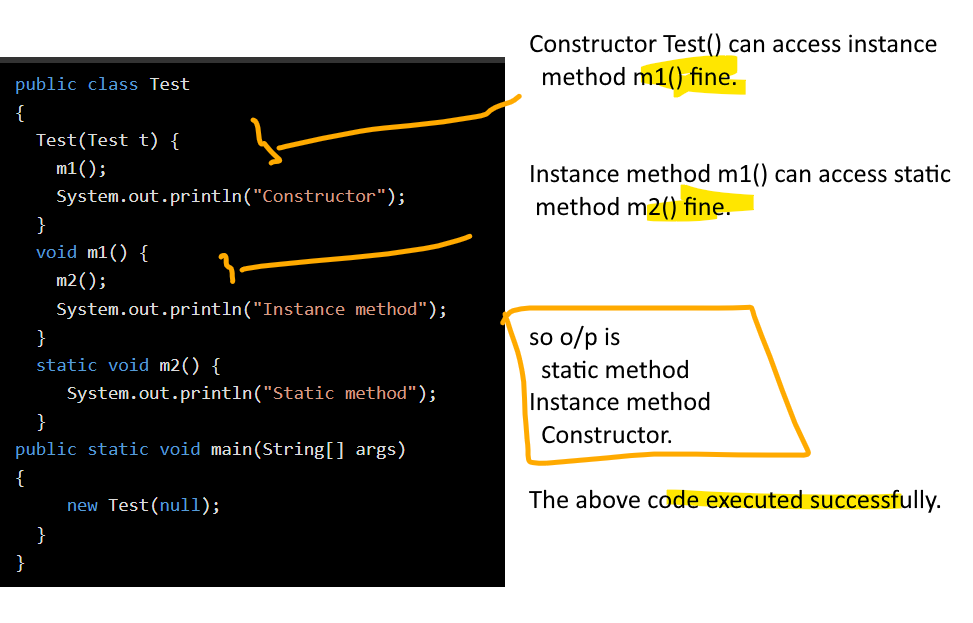
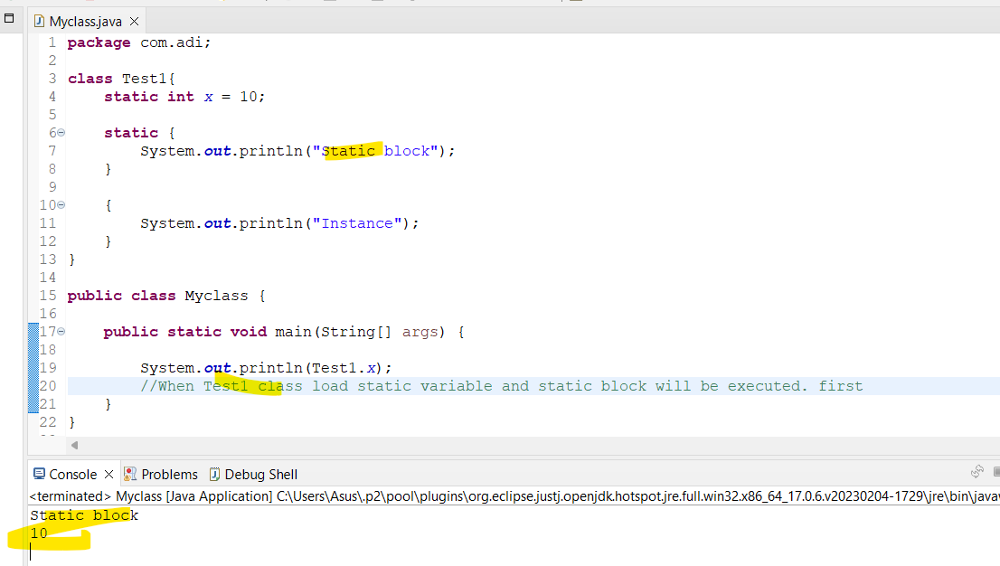

# ** ***Final Interview Question and Answer***
## What is final in java?
- final is a keyword which is used to restrict the user.
- it can be applied with   varialbes, methods and classes.
- When variable is declared as final then it value won't change.
- When class is marked with final keyword then it can't be inherited.[ It prevents inheritance]
    - String, Integer and other wrapper class are final class.
- When method is marked with final keyword then it cannot be overridden by sub class.
## Why constructor cannot be final in java?

### Rules of constructor:
- having same name as that of class name.
    - So if you override the constructor of abstract class in it's subclass 
    - eg class A having constuctor A() and Class B extends A having constructro B() 
    - in overrridden you require A() constructor in B which voilates it's rules.
## Code

##  What is a blank final variable in Java?
- A variable that is declared as final and not initialized at a time of declaration is called blank final variable.
- blank final variable is initialized in constructor.
- blank final static variable initialzied only in static block
## What is the difference between an abstract method and final method in Java?
- The key difference between abstract method and final method is that abstract method must be overridden in the subclass but final method cannot be overridden in the subclass
## Which is the most common predefined final class object in Java?
- String
## What are the two ways to make a class final?
- The first way to make a final class is to declare a class with final keyword.
-  Another way is to declare all of its constructors as private. If a class has only private constructors, it cannot be subclassed.
## Can we create an instance of final class in another class?
- Yes, we can create an instance of final class in another class but cannot be inherited.
## Is it possible to change the value of a final variable in Java?
- No, Java does not allow changing the value of a final variable. Once the value is set, it cannot be modified.
## Why Integer class has been defined final in Java?
- Integer class is a wrapper for int. If it is not declared final, any other class can extend it and modify the behavior of Integer
operations. To avoid it, Integer wrapper class is declared as final.
## Can we declare main method as final?
- Yes, we can declare the main method as final. And it can also run the show.

## Can we mark a block final in Java?
- No, a block cannot be marked final in java.
# ** ***About Static***
## What is static in Java?
- static is a keyword in java that is mainly used for memory management.
- The members that are marked with the static keyword are called static members.
- The users can apply static keywords with variables, methods, blocks, and nested classes. 
### Characteristic of static keyword.
- Shared memory allocation
- Accessible without object instantiation:
- Associated with class, not objects: 
- Can be overloaded, but not overridden:
- Cannot access non-static members:
### static method

- When a method is declared with the static keyword, it is known as the static method.
-  Any static member can be accessed before any objects of its class are created, and without reference to any object.
#### Some restriction in static method
- They can only directly call other static methods.
- They can only directly access static data.
- They cannot refer to this or super keyword in any way.
### static varaible:

- When a variable is declared as static, then a single copy of the variable is created and shared among all objects at the class level.
- Static variables are, essentially, global variables
- All instances of the class share the same static variable.
- We can create static variables at the class level only.
### Static block:

- in order to initialize your static variables, you can declare a static block that gets executed exactly once, when the class is first loaded. 
### Intresting hierachy
#### Static method and static block

- static block executed first. (order of execution when compare with static method.)
#### static varaible and static block

- static block and static varaible are executed in the order they are present in a program.
### Restriction in static mehtod and other stuff
#### Static method with non static or instance varaible.
 
 #### Static method and instance method call.
 
 #### static method with super keyword
 
 ### instance method can access static variable and method
 
 ### Usage of static varaible and methods

### Static Class
- A class can be made static only if it is a nested class.
- We cannot declare a top-level class with a static modifier but can declare nested classes as static. 

## What the outer class won't make static
### Class context
-   An outer class is not associated with any instance of another class.
- It represents a standalone structure that can contain methods, variables, and inner classes.
- Making it static would imply that it is tied to a specific instance, which contradicts its role as an outer class.

### Design principle:
- The design of Java aims to maintain a clear hierarchy and encapsulation.
-  Allowing an outer class to be static would complicate the model 
### Inner class
- Inner class require instance of outer class.
- The relationship between outer and inner classes relies on instances, and a static outer class would break this relationship.
## Can we access static members if no instance of the class is constructed?
- Yes,  because they are not tied to a specific instance. They are shared across all instances of the class.
##  What is the main use of static keyword in java?
- The static keyword can be used when we want to access the data, method, or block of the class without any object creation.
- It can be used to make the programs more memory efficient.
## Can we mark a local variable as static?
-  No, we cannot mark a local variable with a static keyword.
## When does a static variable get memory?
- When a class is loaded into the memory at runtime
- the static variable is created and initialized into the common memory location only once.
##  In which part of memory static variables are stored?
- Inside heap memory there is space called Permanent generation abbreviate as PermGen. Here static varialbe are stored.
## How static variable is different from the instance variable?
### Static varaible:
- A static variable is also called class variable
- Class variable can be accessed inside a static block, instance block, static method, instance method, and method of the inner class
- Class variable is always resolved during compile time
- Static variable cannot be serialized in Java
### Instance varaible:
- an instance variable is also called non-static variable.
- instance variable can be accessed only inside the instance members, and method of the inner class.
- instance variable is resolved during the runtime.
- instance variable can be serialized.
## What is a static method in Java?
- When a method is declared with the keyword ‘static’, it is called static method in java.
## Why is a static method also called a class method?
- A static method is also called a class method because it ties to a class rather than an individual instance of a class.
-  Therefore, we need not to create an object of the class to call and execute static method.
## Can we access static members (such as static variables and static methods) from an instance method?
- Yes, we can access static members from an instance method in java.
## Is it possible to access instance members from a static method?
- No, it is not possible to access instance members like instance variable and instance method from a static method.
## About method signature

## What is the difference between static method and instance method?
### Static method
- A static method is also known as class method
- The only static variable can be accessed inside static method 
- We do not need to create an object of the class for accessing static method 
-  Class method cannot be overridden 
-Memory is allocated only once at the time of class loading 
### Instance method
- the instance method is also known as non-static method.
- static and instance variables both can be accessed inside the instance method.
- in the case of an instance method, we need to create an object for access.
-  an instance method can be overridden.
- in the case of the instance method, memory is allocated multiple times whenever the method is calling.
## Can we have a static method in an interface?
- Yes, from Java 8 and onwards, the interface allows to define a static method with body.
## Can we use this or super keyword in static method in Java?
### About this keyword in static
- We cannot use “this” keyword in the body of static method because static methods are associated with a class, not an instance.
- Only instance methods have an implicit “this” object reference associated with them.
-  Therefore, class methods do not have a “this” object reference associated with them.
### About super keyword with static
- we cannot use the super keyword inside the body of static method.
- This is because we use super keyword to call superclass method from the overriding method in the subclass. 
- Since we cannot override the static methods, we cannot use the super keyword in its body.
##  Is it possible to overload static methods in a class?
-  Yes, we can overload static methods but not override them. This is because they are bound with class, not instance.
## Is it possible to override static method in class?
- No, we cannot override static methods 
- There is concept of method hiding
- Also  static methods belong to a class, not individual objects, and are resolved at compile time by java compiler.
## Can we override an instance method as static.
- No
##  Why static block is executed before the main method in java?
- When the dot class file is loaded into memory, static block is executed.
- After executing the static block, JVM calls the main method to start execution. 
## What is the use of static block in java?
- A static block can be used when
- we want to write that logic inside static block that is executed during the class loading.
- we want to change the default value of static variables.
- we want to initialize static variable of the class.
## . How static block is different from an instance block in java?
### Static block:
- Static block is also called a static initialization block 
-  Static block gets executed before the instance block
- Only static variables can be accessed inside the static block 
- Static block executes when the class is loaded into the memory 
- We cannot use this keyword inside the static block 
### Instance block:
- whereas instance block is also called instance initialization block or non-static block.
- whereas, instance block executes after the static block.
- whereas, both static and non-static variables can be accessed inside the instance block.
- whereas instance block executes only when an instance of the class is created.
- whereas this keyword can be used in the instance block.
## Can we declare a static block inside a method?
- No, we cannot declare a static block inside a method.
## Code Snippet

# *** ***Constructor***
## 8. Can we use this() and super() inside the constructor?

- No, this() and super() cannot be used together inside the constructor.
- WE can call super and this keyword in pgm, but not together.
## 12. Does a constructor of the class get called, before or after creating an object?

- A constructor gets called concurrently when the object creation is going on.
- JVM first allots memory space for the object in the heap and then executes the constructor to initialize instance variables.
- By the time object creation is completed, the execution of a constructor is completed.
## 35. What is constructor chaining in java?

- Constructor chaining in Java is a technique of calling one constructor from within another constructor by using this and super keywords.
- The keyword “this” is used to call a constructor from within another constructor in the same class.
- The keyword “super” is used to call the parent (super) class constructor from within child (subclass) class constructor. It occurs through inheritance.
    - When we create a subclass object, the subclass constructor first calls its superclass constructor before performing its own tasks.
    - This process continues until it reaches the last chained constructor and the end of the chain will always Object class constructor. 
## 41. What is the difference between constructor and method?

## 1. What is a constructor in Java?
-  A constructor is a block of code, similar to a method
- It is used to initialize the state of an object (i.e. instance variable) in a class through a new operator. 
- It is automatically called and executed at the time of object creation by JVM.
## 2. What is the main objective of a constructor in java? Or, Why do we need a constructor in a class as a member?
- The main objective/purpose of a constructor in java is to initialize instance variables in a class 
## 3. When a constructor is called/invoked in Java?
- Every time an object is created with a new keyword. then  The constructor of a class is called.
- In bellow snipette the constructor is called 2 times

## 4. Is it possible for a class to have multiple constructors in java?
- Yes, a class can have multiple constructors with different parameters
- Which constructor gets called for object creation depends on the arguments passed while constructing different objects.
## 5. Does a constructor return any value?
- The constructor can not have any return type even void also 
- because if there is a return type then JVM would consider as a method, not a constructor.
## 6. Can a constructor be marked with the final keyword?
-  No, a constructor cannot be marked with the final keyword.
## 7. Is it possible to inherit a constructor?
- No, a constructor cannot be inherited in java.
## What are possible access modifiers that can be marked for a constructor?
- private: The constructor marked with private can be accessed only from its class.
- protected: The constructor declared with protected access modifier is accessible from any class which resides in the same package.
- public: The public constructor is accessible from any class within or outside the package.
## Is it possible to invoke a constructor of a class more than once for an object?
- No, it is not possible to call a constructor of a class more than once for an object.
- It is invoked only once per object at the time of object creation.
##  How many types of constructors are in Java?
- Default constructor (Non-parameterized constructor)
- Parameterized constructor
## What is a default constructor?
-  A constructor that takes no parameter is called default constructor
## . What is a parameterized constructor?
- A constructor that contains one or more parameters is called parameterized constructor.
## What is the main purpose of default constructor in java?
- The main purpose of default constructor is to initialize default values (null or zero value) to the objects.
- Java compiler creates a default constructor at compile time only if there is no constructor in a class.
##  Is it necessary to define a constructor as the same name as the name of class?
- Yes, a constructor must have the same name as that of class name
- If the name of constructor is different, Java compiler will treat it as a normal method.
##  Is it possible to call a constructor from another constructor if multiple constructors are defined in a class?
- If multiple constructors are defined inside a class, it is possible to call a constructor from another constructor using this keyword.
## What is the use of constructor in java?
- to assign the default value of instance variables.
- to execute a particular code at the time of object creation,
## Can we declare a constructor as private?
- Yes, we can declare a constructor with a private access modifier
- It is mainly done not to allow users to create an object of class from outside of the class.
- eg singleton desing pattern
## Why a constructor defined by Java compiler is always called as default constructor?
- A constructor defined by Java compiler is always called as default constructor because it obtains all its default properties from its class. 
- a) Its access modifier is same as its class access modifier.
- b) Its name is same as class name.
- c) It has no parameters and logic.
##  What is constructor overloading in Java?
- Constructor overloading is a technique in which a class can have more than one constructor having the same name but different parameter lists.
## What are the advantages of constructor overloading in Java?
- Java constructor overloading helps to achieve static polymorphism.
- The main advantage of constructor overloading is to allow an instance of a class to be initialized in various ways.
## Can we have more than one constructor with same signature in a class?
- No, we cannot have more than one constructor with same signature in a class.
## Why do we use/need constructor chaining?
- Constructor chaining can be used when we want to perform multiple tasks in a separate constructor for each task and make their order by chaining.
- It is useful to make the program more readable and easy to understand for everyone.
## How to call one constructor from another constructor in Java?
- Using this(), we can call the current class constructor within the “same class”.
- Using super(), we can call the superclass constructor from the “base class”.
## What is a copy constructor?
- : A constructor which is used to copy the data of one object to another object of the same class type is called copy constructor in Java.
## Can we create an object of class within the same class if a constructor is marked with private?
- Yes, we can create an object of class within the same class if constructor is marked with private but not outside the class.
##  Can class be extended when a constructor is declared private?
- No.l
## Snipette

# *** ***Access Modifier***
## What is the Java equivalent of a struct?
- Struct is defined in C and C++, there is nothing like struct in java.
    - But when we define varaibles, costructor like pojos in java it works as struct.
    - This is eg of mutable struct.
    - and when we define class with public static final fields in java it act like immutable struct.
## 14. Can we define struct members as protected?
- No, we cannot define struct members as protected because struct does not support inheritance.
## About internal keyword in java?
- When no access modifier is provided then it is treated as internal.
- also called as package private or default access modifier.
## 12. Which is the default access modifier?
-  if no access modifier is mentioned with a class or its members.
    -  ‘Internal’ is the default access modifier
    - Internal is a keyword that is used for declaration.
## 15. What is the default access specifier for a class, an interface, and struct declared directly with a namespace?
- Internal
## How many types of modifiers in Java?
- 2 types
    - Access modifiers
    -   Non- access modifiers
## What are Access modifiers in java?
- Access Modifiers are those modifiers that are used to restrict the visibility of classes, fields, methods, and constructors.
- Java supports four types of access modifiers:
    - Private
    - Default
    - Protected
    - Public
- Private:
    - Private members of a class can be accessed only within the class
    - outside u cannot access
- Default:
    - It is accessible with in the class
    - and within the same package
    - They cannot access outside of the package
- Protected:
    - with in the class
    - with in the same package
    - accessible outside of the package via inheritance (to subclasses it is accessible)
    - Outside of package to another class (which is not subclass) cannot access
- Public:
    - access everywhere
## Can we have a private constructor in Java?
-  Yes, we can have a private constructor in Java.
    - The private constructor is used when we do not want to create the object of that class.
    - It is also used in Singleton design and Factory method design patterns.
    - We cannot create a subclass of that class.
## Which access modifiers can be used with a class?
- public 
- default
    - only this access specifier used for the class
## Can we instantiate the object of derived class if the parent constructor is protected?
- No, we cannot instantiate the object of derived class if the parent constructor is protected.
## What are non-access modifiers in Java?
- There are four non-access modifiers in Java.
    - static
    - final
    - abstract
    - synchronized
- static:
    - It is used to check whether the memeber is class member or instance member.
- final:
    - It is used to restrict the further modification of a class, field or method.
- abstract:
    - An abstract class is used for further modification
- synchronized:
    - It is used to achieve the thread safety
## Can we declare a top-level class as private?
- No, we cannot declare a top-level or outer class as private or protected.
- Top level class can be public or with no modifier.
- If u declare it with private then Compiler give "modifier not allowed here" i.e CE
- But inner class can be private / protected.
##  Can we declare an abstract method as private?
- No, an abstract method cannot be private. 
- They must be declared as public, protected, or default so that they can be further modified.
## Can a method or a class be final and abstract at the same time?
- No, it is not possible.
-  the final method or final class cannot be further modified 
- whereas an abstract class or an abstract method must be modified further.
## What is the default access modifier for Interface?
- public 
- Other than public no access modifier is allowed.
## What is access modifier for enumeration?
- Enumeration members are always public. 
-  No other access modifiers are allowed.
## Which is the least restrictive access modifier in Java?
- public 
##  Which is the most restrictive access modifier in Java?
- private
## Which access modifier is also known as Universal access modifier?
- public
## Explain visibility control in Java.
- Visibility control in Java is implemented by the access modifiers.
# *** ***Java Fundamental Interview Questions for 2025***

## 1. What is object-oriented programming?
- object-oriented programming is about creating objects that contain both data and methods.
-  It is an extension of procedural programming.
## 3. What is a procedural programming paradigm?
- Procedural programming is about writing procedures or methods that perform operations on the data
### Advantage
- OOP is faster and easier to execute
- OOP makes it possible to create full reusable applications with less code and shorter development time
## What is Jdk, JRE and Jvm?

### Jdk
- Jdk stands for Java developement kit.
- It internally contains JRE + JVM
- Jdk provide all the tools (javac compiler,debbugger etc) to work with Java language.
### JRE
- JRE stands for Java Runtime Environment
- It provide environments to execute the Java Program.
- It contains JVM.
### JVM
- JVM stands for Java virtual machine.
- It is actually responsible to execute a java program.
- It provides interpreter s/w written in C language which can execute the java program.
## About Java

### Remember

### What is line by line interpretation?
- JVM can interpret bytecode line by line. 
- JVM ये  bytecode को  parse करलेंगे . 
- और  उसमे  जो  instruction है    उनको  group कर  लेंगा.
     - Like (1st कोनसा  चलना  और  2nd  कोनसा )
- Then JVM ये  grouped instruction को  then line by line चलता  है
### Why interpreter is slow than compiler.
- At 1st parse it will group the instruction 
- And at 2nd parse it will run line by line grouped instruction
- That’s why interpreter is slow and compiler is fast.
### Intresting insight
- Instead of always interpreting, sometimes JVM can compile also.
- Jvm के  अंदर  JIT (Just in time compiler) भी  होता  है 
- Eg: कोई  block of code है , JVM को  लग  रहा  है  ये   दुबारा  repeat होंगे . So JVM उसको   compile करके  रख  लेता  है .
- वो  code को  बार  बार  compile करके  interpret नहीं  करनेगा .
- Add function 10 बार  use हो  रहा  है 
- तो  JIT उसको  compile करके  रख  लेंगा .. और  interpreter उस  compile code को  use कर  लेंगा .
## About JVM architecture

- Java file or Source file having extension as .java 
- It will compile by Compiler and converted to .class file or bytecode.
- And this bytecode is given to JVM.
### Internal Architecture of JVM.

### 1)	About Class-loader:

#### ***1.1)About Loading:***
-	Reads .class file
-	Generate binary data
-	Save info in method Areas
    -	Fully qualified name of loaded class
    -	It’s immediate parent class
    -	The .class file is related to particular interface, Enum etc.
    -	Modifier, method info etc.
- ***To load .class file in Class loader we have 3 class loader.***
    - 1.	Boot-Strap class loader
    - 2.	Extension class loader
    - 3.	System/ Application class loader
- ***Its Segregation will be based from where it will load .class file.***
- ***Bootstrap Class loader***
    - It will load the classes from bootstrap path.
    - “JAVA_HOME/jre/lib”
- ***Extension Class loader***
    - It is the child class of Bootstrap class loader. 
    - It will load the class from configurable path.
    - “JAVA_HOME/jre/lib/ext”
- ***System/ Application Class Loader:***
    -  It is child class of Extension class loader. 
    - Load classes from application class path.
	- Environment variable is mapped to application class path.
#### Delegation Hierarchy:

- First it will try to fetch/load class from bootstrap class loader. 
- If class is not found there then Extension class loader and so-on-so-forth.
#### ***1.2)About Linking:***

- There are 3 processes in linking I.e. Verification, Preparation and Resolution.
####  ***1.2.a)About Verification:***
-	Ensure correctness of .class file
-	Check for format
-	If verification fails throw java.lang.VerifyError
    -	यदि  कोई  .class file में  change कर  देता  है .. तोह  उससे  ये  invalid बता  देता  है 
    - और  .class file फिर  execute नहीं  होती
#### ***1.2.b)About Preparation:***
- 	Allocates memory for static members.
-	Initialize memory to default values.
#### ***1.2.c)About Resolution***
-	Transform symbolic references into direct reference.
    -	हमारे  pgm में  symbolic name होते  है .
    -	resovlution उनको  original name से  replace कर  देता है
#### ***1.3)Initialization***
-	All static variables are assigned with values.
    -	Static value की   default value  को  orginal value से  replace कर  देता  है .
-	Static block will be executed from top to bottom.
## ***2)	Memory Areas:***

### 2.1) Method Area
- It will store class level data information
	- static variable
	- static reference
	- static block
- Only 1 method area per JVM.
- shared resource.
### 2.2) Heap Area
-  Object info store in heap area.
	- Object
	- instance variable
	- arrays
- One heap area per JVM
- Shared resource.
### 2.3) Stack area:

- For each thread one runtime stack is created.
- The block of stack is called Activation record/stack frame.
- Where we store methods calls.
- local variable of current running method.
- Runtime stack will be destroyed after thread is terminated.
- not a shared resource.
### 2.4) PC Register
- It stores address of next executing instruction
- Each thread has a separate PC register.
### 2.5) Native Method stack
-   Store native method information
-  Separate native stack for each thread.
### Remember:
-	Method Area and Heap Area are not thread safe.
-	Rest others areas are thread safe.
### ***3)Execution engine***

-	It is the component which executes the bytecode (I.e. the program).
-	Contains other components
### 3.1) Interpreter:
- It will execute the bytecode line by line.
### 3.2) JIT compiler:
- If any method calls multiples times.
- then interpreter interprets that method calls multiple time.
- JIT compiler compiles that code and whenever that method calls it will return value.
- Execution fast.
- It provides native code to avoid re-interpretation.
### 3.3) Garbage Collection
- Destroyed un referenced objects.
### ***4) Native method libraries***

-	Collection of Native libraries (C, C++ etc.) which are required by execution engine.
### ***5) JNI (Java Native Interface)***
- Execution engine use Native libraries via intermediate interface named as JNI.
## 2. What are the four important characteristics of object-oriented programming?
- The most important characteristics of object-oriented programming are 
    - Encapsulation,
    -  Inheritance,
    -  Abstraction, 
    - and Polymorphism.
##  What are the two major differences between Object-Oriented Programming and Procedural Programming?
### Object-Oriented Programming:
- It focuses on the data.
- It is based on the four main principles of Encapsulation, Inheritance, Abstraction, and Polymorphism.
### Procedural Programming:
- It focuses on doing things rather than on data.
- It is based on the sequence of instructions.
##  What is Java?
- ava is a powerful, versatile, and high-level programming language developed by Sun Microsystem. 
- Originally, Java was known as OAK.
- It is used for developing platform-independent software (applications) running on desktop computers, mobile devices, and servers.
## Who developed Java?
-  Java was invented by James Gosling and his team members in 1994.
## Why is Java System Independent (Architecture neutral)?
- Java is system independent because Java bytecode is not associated with any particular hardware platform.
-  It can be executed on any system machine with any processor and any operating system that implements Java Virtual Machine.
## Why is Java Portable?
- Java is portable because java program gives the same result on every system machine.
## What are the features of Java language?
- There are the following features of Java language. They are as follows:
- Simple
- Object-oriented
- Distributed
- Robust
- Secure
- System Independence
- Portability
- Interpreted
- High performance
- Multithreaded
- Dynamic
## Give a few examples of object-oriented language other than Java.
- Two examples of object-oriented languages other than Java are Python, and C++.
## What is Java API?
- Java Application Programming Interface (API) is a very large collection of pre-packaged, ready-made software components that provides the core functionality of the Java programming language.
## What is the popular Java API?
- java.lang
- java.io
- java.util
- java.math
- java.sql
## What is Java Library?
-  A Java library is a collection of programs that are used to perform the many common tasks in the program.
##  What is Bytecode in Java?
- Bytecode in Java is a highly optimized set of instructions for the Java Virtual Machine (JVM) that reads and interprets to run the java program.
## What are the characteristics of Java Bytecode?
- Byte code is independent of processor, i.e. java program can be executed on any processor architecture.
- It does not depend on operating systems such as Windows, Linux, and Mac OS.
## What is the difference between bytecode and machine code?
- The main difference between the byte code and machine code is that byte code can be run only on JVM whereas machine code is a set of instructions in machine language that can be directly run by the CPU.
## What is source code in Java?
- Java code written by a programmer is called source code.
## Why compiled java code can execute on different computer machines?
- Compiled java code can execute on different computer machines because JVM exists differently for different operating systems.

