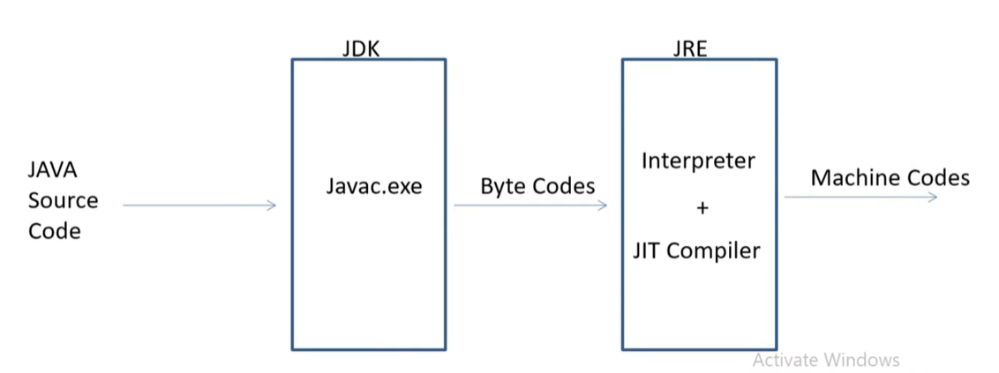
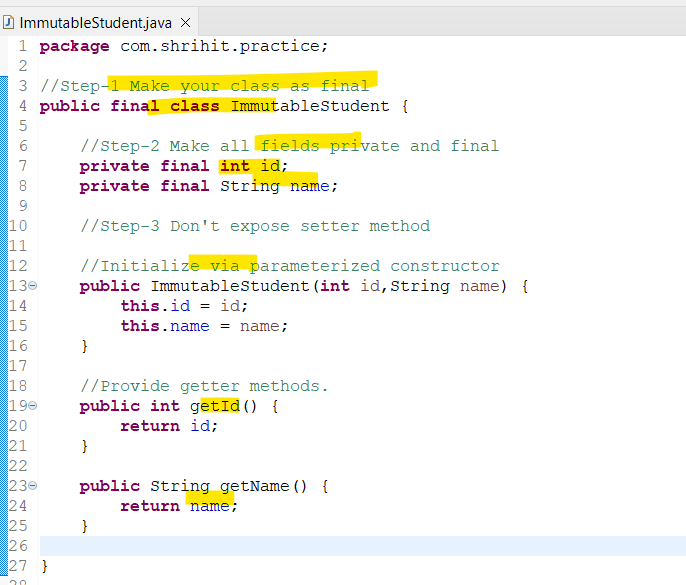
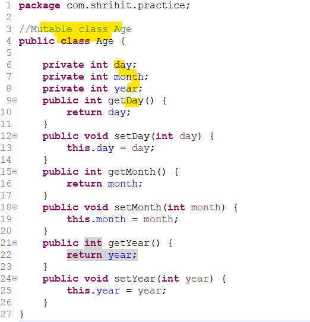
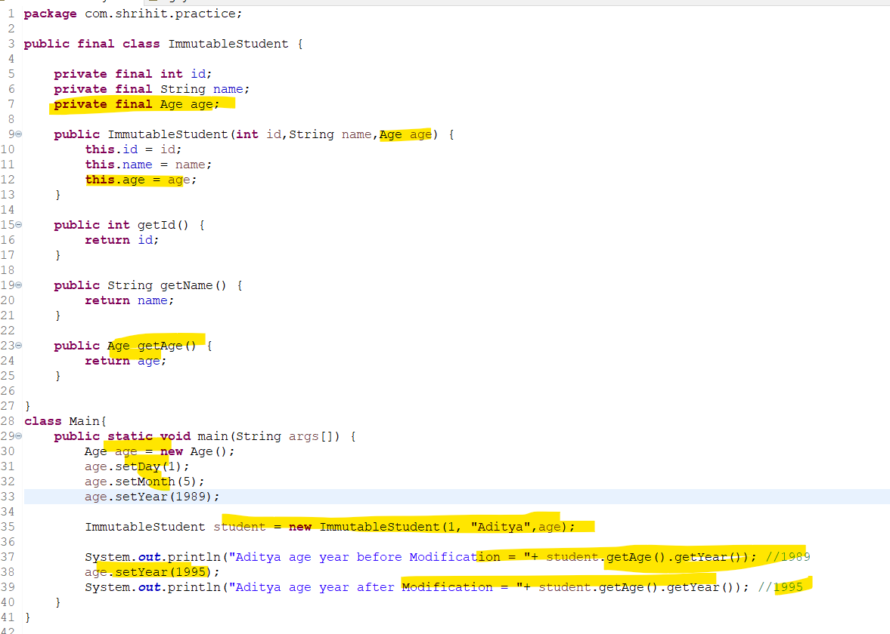
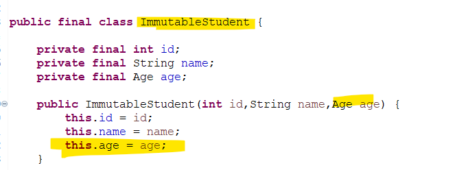
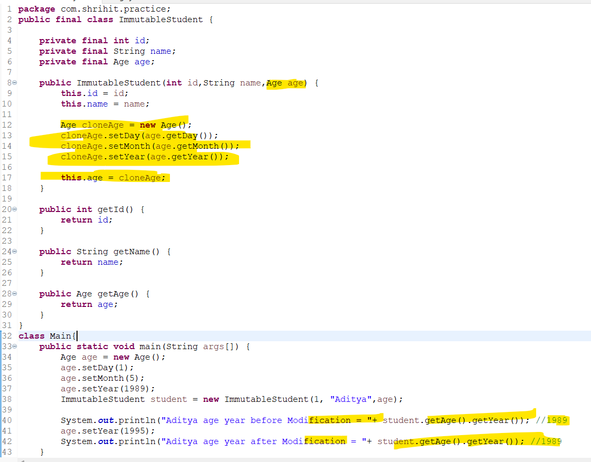
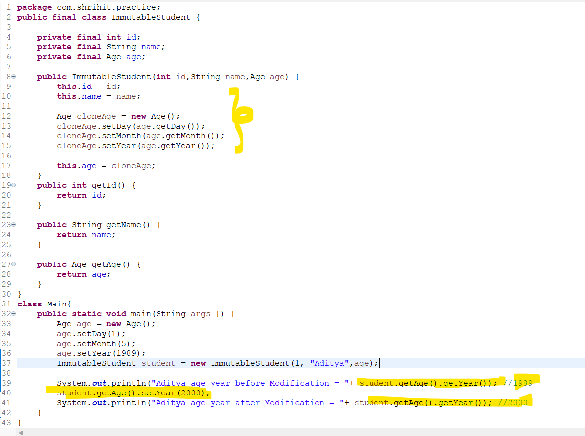
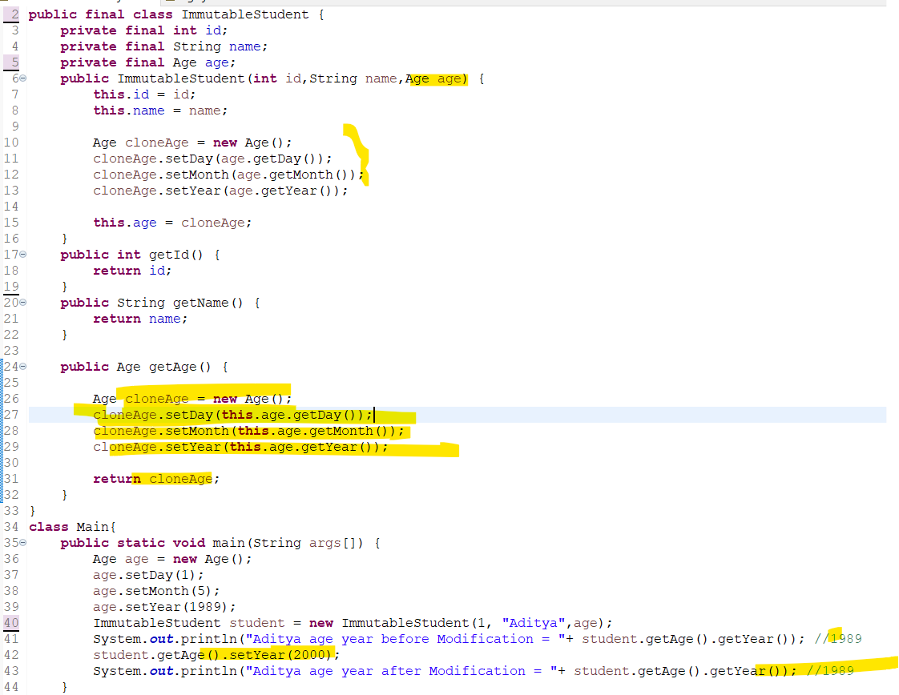

## Why Java is not 100% Object oreinted programming.
- Since it includes primitive data types.
    - like byte,short, int, long, float, double, Char and boolean.
- When it will be object oreinted when every thing (i.e every function) revolve around object.
- In order to wrap this primitive data type Java created Wrapper classes. So that they achieve OOP.
## Why pointers are not used in Java?
- Java is platform independent. 
- So if we use pointers the address of the variable varies in different machines.
    - Pointers are inherently tied to the hardware and memory structure of a particular platform.
- Thus using pointers becomes invalid and provides different result in different machine.
## What is JIT compiler in java?

### Terminology:
- Byte code is m/c independent.
- Jdk, Jre and Jvm are m/c dependent or m/c specific.
- System can understand only m/c language.
##
- So Jdk provides compiler which convert your java source code into byte code.
- To convert byte code into m/c language. JRE/JVM provides 2 things
    - intrepreter
    - JIT compiler (just in time compiler.)
- Interperter:
    - Interperter read byte code line-by-line and convert it into m/c language.
    - Due to this 
        - time increases
        - efficienty decreases.
- JIT compiler:
    - It compiles bunch of byte code and convert into m/c code.
    - Responsible for performance optimization.
## Why String is immutable in java?
- Strings are immutable means their values cannot be changed once they are created.
- ***Security:*** Strings are used for sensitive data like usernames and passwords.
- ***Thread Safety:*** Since string values cannot be changed, they are automatically thread-safe, means multiple threads can safely use the same string. 
- String Pool: Java stores string literals in a pool to save memory.
- ***Efficiency:***
The JVM reuses strings in the String Pool by improving memory usage and performance
## What is Marker interface?
- Also called as Tagging interface.
- Marker interface does not have any method or constant define in it.
- It is used to provide additional information about object.
- Eg of marker interface
    - clonable, Serializable, Remote.
### About Clonale
- If we try to clone an object that doesn’t implement this interface, the JVM throws a CloneNotSupportedException.
-  Thus, the Cloneable marker interface is an indicator to the JVM that we can call the Object.clone() method.
## Can you override private or static method in java?
### About static method overidden concept
- No, you cannot override static methods in Java.   
    - This is because static methods are associated with the class, not with an instance of the class. 
- If you create similar method with same return type and same method argument in child class then it will hide superclass method. Called as Method hiding.
- ***Catch:***
- U can call static method with object refrence.
    - Means you create object and call static method.  
    - U can but u should not.

### About private method overridden concept.
- ***Private method*** is 
Not visible to child calsss
    - So there is no point of ***override*** correct.
- U need to create same method with same signature in child class in order to access it.
## Does finally always execute in java?
- A finally block is always execute regardless of whether an exception thrown or not.
- ***2 condition when finally block not execute***
    1) System Crash
        - if system is getting crash then finally block won't execute
    2) System.exit()
        - If someone explicitly call System.exit then finally block won't execute.
## What methods does the object class have?
### About object class
- ***java.lang.Object*** is the parent of all the objects you created in java.
- It contains 11 methods which are available to it's object.
### protected Object clone() 
- It creates and returns copy of Object.
### boolean equals(Object obj) 
- ***Object class equals()*** method basically compares 2 objects equals or not.
- For this internally they uses == operator 
- So basically Object class equals() ***compares refrences*** of the objects.
- It is recommended that you should override it.
- ***String class*** overrides the ***equals()*** method.
- String class equals() ***compares content*** instead of refrence.
### protected void finalize()
- If there is no refrence available for object then it is eligible for garbage collection via Garbage collector.
- And if you want to run some logic to be execute before garbage collection.
- u should explicitly write your logic in finalize() method.
### Class<> getClass()
- It return runtime instance of class.
### int hashCode()
- It returns hash code value for an object.
### toString()
- It returns String representation of the object.
### void notify()
- Wakes up a single thread that is waiting on object's monitor
### void notifyAll()
- Wakes up all thread that are waiting on object monitor.
### void wait()
- Wait the execution of current thread until another thread invokes or call notify() or notifyAll() method for this object.
### void wait(long timeout)
- same as above + until time elapsed.
### void wait(long timeout,int nanos)
- same as above + until time elapsed.
## How can you make a class immutable.
### Step-1 Declare class as final. 
- So it can't be extended.
- It ensure's that the state of an object can't be change through inheritance.
### Step-2 Make all feilds private and final.
- This ensures the state of an object cannot be change  after it's created.
#### Due to private fields.
- Direct access won't allowed.
### Due to final fields.
- Value can't be change once assigned.
### Step-3 Don't provide setter methods for variables.
### Step-4 If class holds mutable object.
### So in Constructor
- Initialize all fields via constructor performing deep copy.
###  In getter method.
- Always return clone copy. Never return real instance.
### Eg:

- The above class is a very simple immutable class which doesn’t hold any mutable object and never expose its fields in any way;
### Passing Mutable object to Immutable class

- We claim that ImmutableStudent is an immutable class whose state is never modified after construction
- However in the above example we are able to modify the age of Aditya even after constructing Aditya object.
- If we go back to the implementation of ImmutableStudent constructor, we find that age field is being assigned to the instance of the Age argument

- So whenever the referenced Age is modified outside the class, the change is reflected directly on the state of Aditya.
### Solution
- Never set your mutable field to the real instance passed through constructor.
- In construtor use concept of deep clone i.e Always use clone copy of the passed argument.

### Returning Mutable object from Immutable class.

### Solution:
- Always return clone copy of the field. Never return real object instance.

- Now this is immutable class.
### Disadvantage:
- The only disadvantage is that they consume more memory than the traditional class since upon each modification of them a new object is created in the memory
## Waht is singleton class in java? How can we make singleton class?

