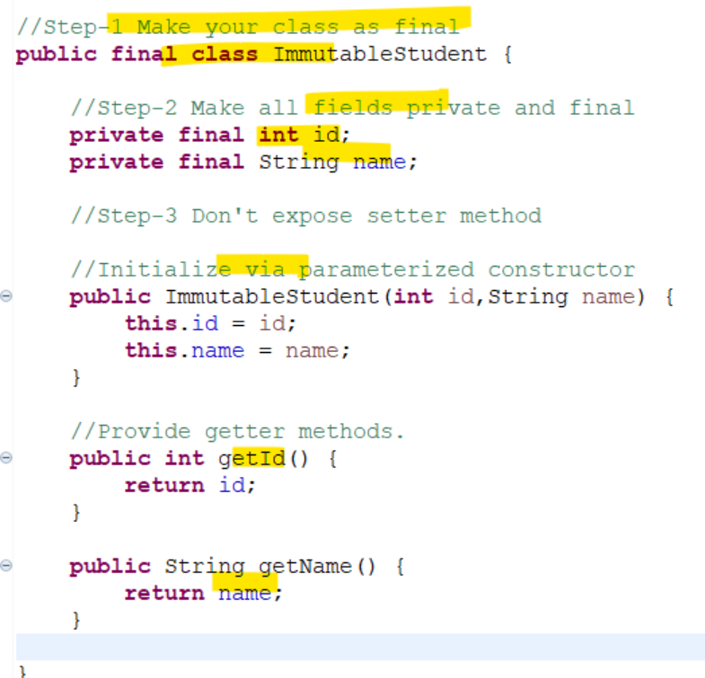

## Why Java is not 100% Object oreinted programming.
- It includes 8 primitive data types like byte,short, int, long, float, double, Char and boolean.
## Why pointers are not used in Java?
- For a particular platform, Pointers are tied to hardware and memory allocation.
- And Java is platform independent language i.e u write code once and run every-where.
- So if we use pointers the address of the variable varies in different machines.
- Thus pointers provides diffrent result in different m/c.
## What is JIT compiler in java?
- Compiler convert Java source code into byte code(m/c independent)
    - compiler provided by Jdk.
    - interpreter and JIT compiler provided by Jvm/Jre.
    - Jdk, Jre and JVM are m/c dependent
    - System understand m/c language.
- Intrepreter convert byte code into m/c code by interpreting line by line.
    - Performce decrease
- JIT compiler converts bunch of byte code into m/c language.
    - Performance increase.
- Please ***see Notes***
## Why String is immutable in java?
- Immutable values can't be change once created.
- Java stores String literals in string pool. In oreder to save memory.
- Due to immutablity String can be used in username, password, file system, n/w etc.
- Please see ***notes***
## What is Marker interface?
- A marker interface does not contain anything.(i.e method and constant)
- It is used to provide additonal information about object.
- Eg: serializabe, Cloneable 
- In order to clone some object
    - we need to provide hint to JVM that this object is getting clone
    - via implementing Cloneable(i.e Marker) interface.
    - Otherwise CloneNotSupportedException come accross.
    - ***see notes***
- Also called tagging interface.
## Can you override private or static method in java?
- U can't override a Static method.
- if you do it then Concept of method hidding apply in it.
- U can't overrided private method. Since child class won't see it.
- ***See notes***
 ## Does finally always execute in java?
 - A finally block always executes.
- 2 cases when it will not execute
    - System crash
    - System.exit()
- ***See notes**
## What methods does the object class have?
- clone() - create copy or clone
- equals() - compare refrences uses internally == operator
- finallize() - executes logic b4 garbage collection.
- getClass() - Runtime instance
- hashCode() -  return hashcode
- toString() - return String represntation for object.
- notify() - wakes up single thread
- notifyAll() - all thread
- wait() - wait the current therad
- wait(long timeout) - wait till time elapse.
- wait(long timeout,int nanos) - same as above
- ***See notes**
## How can you make a class immutable.
-  Declare class as final. 
-  Make all feilds private and final.
-  Don't expose setter methods for variables.
-  For mutable object to initialize in parameterized constuctor, make sure initiaze it via clone copy of passed argument.[also called as deep copy]
- For mutable object in getter method, Always return clone object in getter method and never return real instance.

***See original notes***

