## Need to calculate only non-empty String 
```java
package com.ramesh;

import java.util.Arrays;
import java.util.List;
import java.util.function.Predicate;

public class Main {

	public static void main(String[] args) {
		
		List<String> words = Arrays.asList("Java","Stream","","Lambda","","Filter");
		
		// Need to calculate only non-empty String 
		
		//It will indicate whether String is empty or not
		Predicate<String> nonEmpty = String::isEmpty; //here 2 empty String found
		
		long count = words.stream()     //It will filter out empty String
						.filter(nonEmpty.negate()) //negate() method told Predicate for not counting empty String
						.count();
		
		System.out.println("    on empty String are = "+count); //Count of non-empty String are 4

	}

}
```
## Calulate only empty String from ArrayList
```java
package com.ramesh;

import java.util.Arrays;
import java.util.List;
import java.util.function.Predicate;

public class Main {

	public static void main(String[] args) {
		
		List<String> words = Arrays.asList("Java","Stream","","Lambda","","Filter");
		
		// Need to calculate only empty String
		
		Predicate<String> nonEmpty = String::isEmpty; //here 2 empty String found
		
		long count = words.stream()     
						.filter(nonEmpty) 
						.count();
		
		System.out.println("      empty String are = "+count); 

	}

}
```
## Given String is not null and empty via Predicates
- To combine Predicate, we have and () method behaves like logical &&.
- We have test() method in Predicate for evaluation { मूल्‍यांकन / the process of determining the value} of given argument.
### Main
```java
package com.ramesh;

import java.util.function.Predicate;

public class Main {

	public static void main(String[] args) {

		Predicate<String> nullCheck = arg -> arg != null;  //Checks given argument is not null
		Predicate<String> emptyCheck = arg -> arg.length() > 0; //Checks given String/argument is not empty
		Predicate<String> nullAndEmptyCheck = nullCheck.and(emptyCheck); //It will combine null check and emptyCheck Predicate
		 //That given String is not null and empthy.

		System.out.println("        " + nullAndEmptyCheck.test(null));//test method checks with Predicate that
		                                                       //given argument/String is not null and empty...
		
		//So here it will evaluate nullAndEmptyCheck predicate
		 //1st argument is null so it won't go for checking 2nd argument. 
		  //behaves like logical && operation. So result is false.
	}
}
```
###  Main-2
```java
package com.ramesh;

import java.util.function.Predicate;

public class Main {

	public static void main(String[] args) {

		Predicate<String> nullCheck = arg -> arg != null; 
		Predicate<String> emptyCheck = arg -> arg.length() > 0; 
		Predicate<String> nullAndEmptyCheck = nullCheck.and(emptyCheck);

		System.out.println("        " + nullAndEmptyCheck.test("javaguides")); //If i pass argument as String
		
		//So here it will evaluate 
		 //1st arguement is no null - true 
		// now evaluate 2nd condition - is argument length greater than 0 -- tru
		 // true && true -- true
	}

}
```
## Find Maximum and Minimum number in java8 using Stream.
- Java8 Stream provide max() and min() method to find maximum and minimum numbers
### Main
```java
package com.ramesh;

import java.util.Arrays;
import java.util.Comparator;
import java.util.List;

public class Main {

	public static void main(String[] args) {
			
		List<Integer> numbers = Arrays.asList(10,30,40,100,90,80);
		
		//1. Convert list into Stream via Stream()
		 //2. Stream has max() method which expect Comparator as parameter
		 //3. We pass Comparator via Comparator.naturalOrder()
		 // 4. max() method return an optional so use get() method to get the value
		Integer max = numbers.stream()
					    .max(Comparator.naturalOrder())
					    .get();
		
		System.out.println("     Max val = " +max); //Max val = 100
		
		//1. Convert list into Stream via Stream()
		 //2. Stream has min() method which expect Comparator as parameter
		 //3. We pass Comparator  via Comparator.naturalOrder()
		 //4. min() mehtod return an Optional so use get() method to get the value.
		Integer min = numbers.stream()
					  .min(Comparator.naturalOrder())
					  .get();
		
		System.out.println("     Min val = " +min); //Min val = 10
		
	}

}
```
## Write a pgm to reverse each word of a String using java8
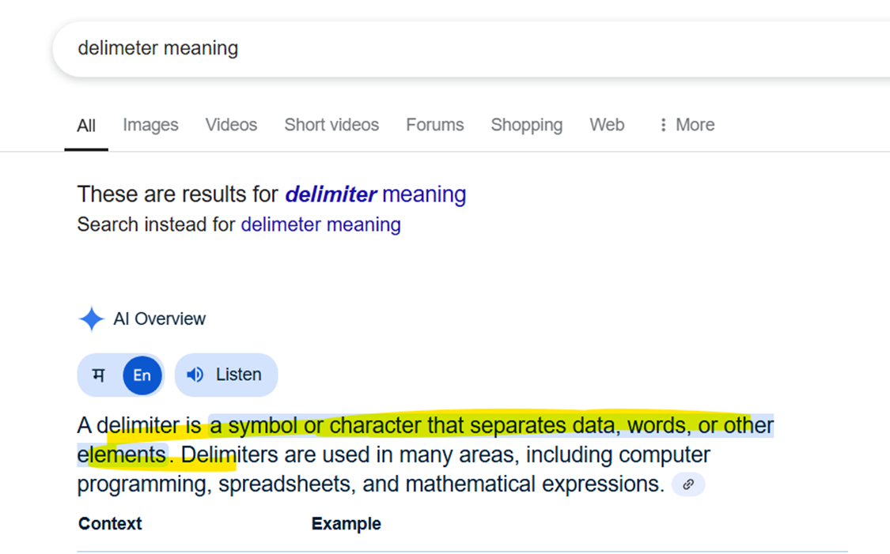
### Main
```java
package com.ramesh;

import java.util.Arrays;
import java.util.List;
import java.util.stream.Collectors;

public class Main {

	public static void main(String[] args) {
			
		String inputString = "Hello World This Is Java"; //This is input String
		
		//Split this string into words via split() method 
			// on the basis of space(delimeter). It will return String[] array
		String[] words = inputString.split(" ");
		
	
	
		//1. Convert this array into Stream via Arrays.stream()
		 //2. Called map() method 
			// to map each words in reverse order via lambda expression
		//3. word is parameter to lambda expression
		 //4. Then use StringBuilder it has reverse method 
		     //First pass word as parameter and then call reverse method
		     //Convert StringBuilder into String via toString()
	    //5. Call collect() method to collect the result 
		   //Pass Collectors.toList() method
		//Store result into List<String>
		List<String> result = Arrays.stream(words)
							  .map((word) ->
							  		new StringBuilder(word).reverse().toString())
							  .collect(Collectors.toList());
		
		System.out.println("   " +result); // Print the result
		
	}

}
```
### Mistake in spliting. Always give proper space while split else it will give wrong output.
```java
package com.ramesh;

import java.util.Arrays;
import java.util.List;
import java.util.stream.Collectors;

public class Main {

	public static void main(String[] args) {
			
		String inputString = "Hello World This Is Java";
		
		String[] words = inputString.split(""); //Here we make mistake in spliting.
	
		List<String> result = Arrays.stream(words)
							  .map((word) ->
							  		new StringBuilder(word).reverse().toString())
							  .collect(Collectors.toList());
		
		System.out.println("   " +result);
		
	}

}
```
## How to find frequency of each character in a String using java8.
- String inputString = "javaguides";
-  {a=2, s=1, d=1, e=1, u=1, v=1, g=1, i=1, j=1}
### Main
```java
package com.ramesh;

import java.util.Map;
import java.util.function.Function;
import java.util.stream.Collectors;
import java.util.stream.IntStream;
import java.util.stream.Stream;

public class Main {

	public static void main(String[] args) {
			
		String inputString = "javaguides";
		
		//Convert this inputString into Stream of Characters using chars() method
		 //chars() method return IntStream
			//Instream represent ASCII value of each characters.
		IntStream stream = inputString.chars();
		
		//Convert AscII value back to character via mapToObject() method
			//How to pass argument in it. (check it bellow)
		 //It will return Stream of Character
		Stream<Character> characterStream = stream.mapToObj(c -> (char) c);
		
		//In order to collect the result call collect() method
		 //then call groupBy method to group key valu pair
		  //Call Function.Identity - It will return charcter in a Stream
		   //Call Collectors.counting method to count frequency of each character in a group.
		//Take result into Map
		Map<Character, Long> result = characterStream.collect(Collectors.groupingBy(
											Function.identity(),
											Collectors.counting()));
		
		System.out.println("    " + result);
	}
}
```
## Write a Java pgm to find age of the person in years. If birthdate has given.
```java
package com.ramesh;

import java.time.LocalDate;
import java.time.Period;

public class Main {

	public static void main(String[] args) {
		
		LocalDate birthDate = LocalDate.parse("1989-05-21");
	
		//To find age we need currentDate via LocalDate.now() method
		LocalDate currentDate = LocalDate.now();
		
		//calculate Period between birthday Date and Current Date
		 //Period has between method where we pass 1st par-startDate and 2nd par-endDate
		Period period = Period.between(birthDate, currentDate);
		
		//U can get the years from this period
		System.out.println("    Years = "+period.getYears());// Years = 35
	}
}
```
## Write a java pgm to remove the duplicate elements from the list using Java8 Stream
```java
package com.ramesh;

import java.util.Arrays;
import java.util.List;
import java.util.stream.Collectors;

public class Main {

	public static void main(String[] args) {
		
		List<Integer> listWithDuplicates = Arrays.asList(1,2,3,2,1,4,5,4,5,6);
		
		//1. Convert list into Stream via stream()
		 //2. Stream has dinstinct() method
		  //distinct() -- it an intermediate operation filters. It removes duplicate elements
			//and keep only unique elements
		 //3.  call collect() method to collect result back into list
		List<Integer> result = listWithDuplicates.stream()
								.distinct()
								.collect(Collectors.toList());
		
		System.out.println( "          "+result); //[1, 2, 3, 4, 5, 6]
		
		
	}
}
```
### Write a java pgm to retrieve the last element of list of Strings using java8
```java
package com.ramesh;

import java.util.Arrays;
import java.util.List;

public class Main {

	public static void main(String[] args) {
	
		List<String> listOfStrings = Arrays.asList("One","Two","Three","Four","Five","Six");
		
		//Convert list into Stream via stream()
		 //Stream has skip() method which skip the element of Stream
		   //passing size of list
		     //and for keeping last element -1
	    //get that last elment via findFirst() method
		String result = listOfStrings.stream()
						.skip(listOfStrings.size()-1)
						.findFirst()
						.get();
		
		System.out.println("      "+result); //Six
	}
}
```
## Write a java pgm to find the sum of all digit of a number using java8
```java
package com.ramesh;

import java.util.stream.IntStream;

public class Main {

	public static void main(String[] args) {
	
		int number = 12345;
		
		//Convert integer number into String via String.valueOf() method
		 // then convert that String into Stream via chars()
		 // chars() method return IntStream which contains ASCII value of character in Stream
		IntStream stream = String.valueOf(number)
							.chars();
		
		//Convert ASCII value back into numerical value
		 //Here we use map() method
		  //Characters has getNumericValue() method
		    //It will get numeric value from the character
		//Call sum() method to sum up all values
		int result = stream.map(Character::getNumericValue)
						.sum();
		
		System.out.println("      " +result); //15
	}
}
```
## Write a java pgm to print even number using java8
```java
package com.ramesh;

import java.util.Arrays;
import java.util.List;

public class Main {

	public static void main(String[] args) {
	
		List<Integer> numbers = Arrays.asList(1,2,3,4,5,6,7,8,9,10);
		
		//Convert list into Stream via stream()
		 //Stream has filter() method
		  //Will use it to keep even number in Stream
		// filter take Predicate as FI we need to provide lambda expression
		//Call forEach() method to print result
		  //forEach() method takes consumer as FI
		numbers.stream()
		.filter(number -> number%2 == 0)
		.forEach(System.out::println);
		

	}
}
```
## Write a java pgm to sort a list of Strings alphabetically using java8
```java
package com.ramesh;

import java.util.Arrays;
import java.util.List;
import java.util.stream.Collectors;

public class Main {

	public static void main(String[] args) {
	
		List<String> words = Arrays.asList("Banana","Apple","Pear","Cherry","Strawberry");
		
		//Convert list into Stream via stream()
		 //Stream has sorted() method for sorting string in alphabetically order
		//Collect sorted string back in list collect(Collectors.toList)
		List<String> result = words.stream()
								.sorted()
								.collect(Collectors.toList());
		
		System.out.println("     "+ result);// [Apple, Banana, Cherry, Pear, Strawberry]
	}
}
```
## Guessing output
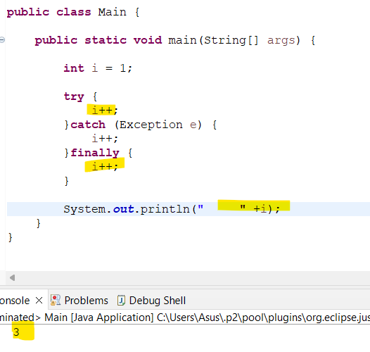
```java
package com.ramesh;

public class Main {

	public static void main(String[] args) {
	
		int i = 1; //value initialize  i = 1
		
		try {     //controls comes to try block 
			i++;          //here value is incremented by 1  so i = 2
			
		}catch (Exception e) { //Since no exception thrown from try block.. the catch won't executes
			i++;
		}finally { //controls comes to finally block
			i++;	//finally blocks always executes regardless of exception happens or not so i= 3
		}
		
		System.out.println("     " +i); // 3
	}
}
```
## What happen if you put the return statement in the try or catch block? Will finally block is executed.
- Yes, finally block will execute regardless
    - 	you put return statement in try or catch block.
    - 	Or exception happens in try of catch block.
### pgm
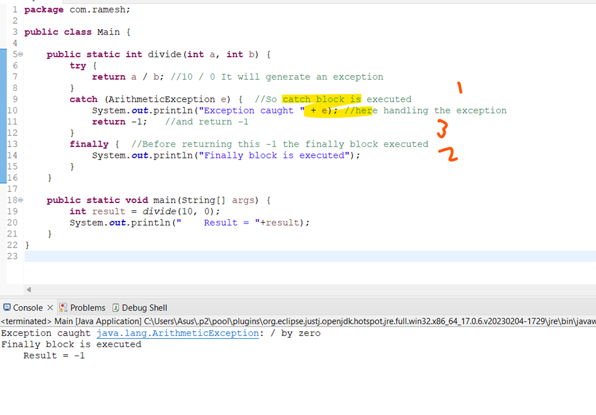
### Observation
- So see the order of execution here
    - 1)	Exception is caught 
    - 2)	Before return -1 finally block executes
    - 3)	Then result is printed
## What happen if you put the System.exit() inside the try or catch block? Will the finally block executes?
- NO
- If system.exit() is called inside the try or catch block. 
- The Jvm terminates the pgm immediately and the finally block won’t be execute.
### Pgm
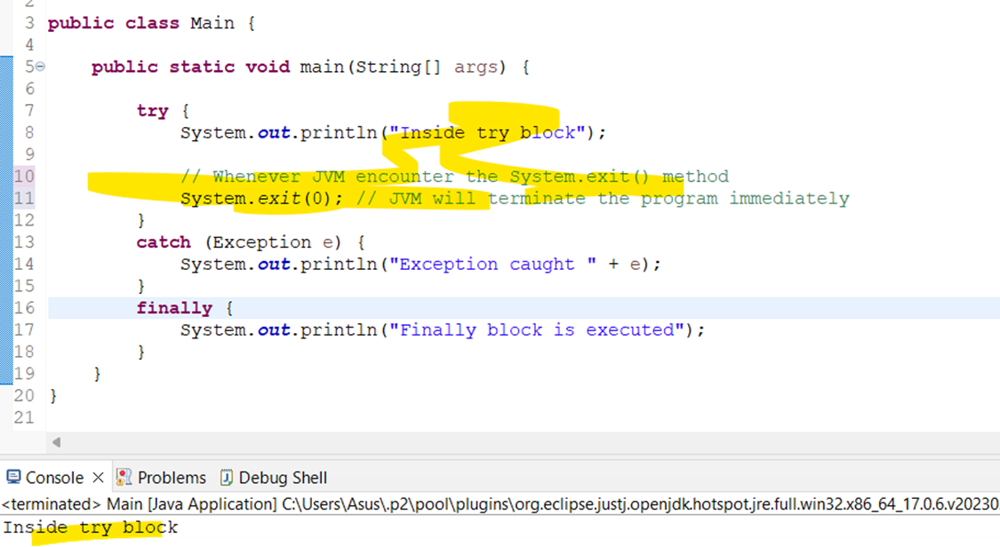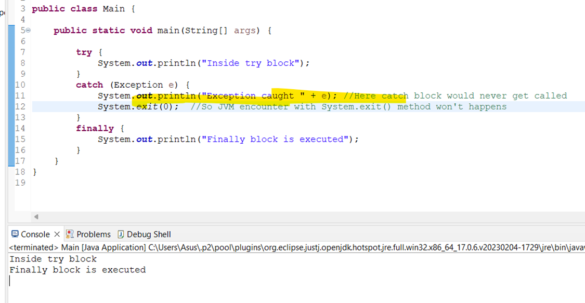
## Guess output
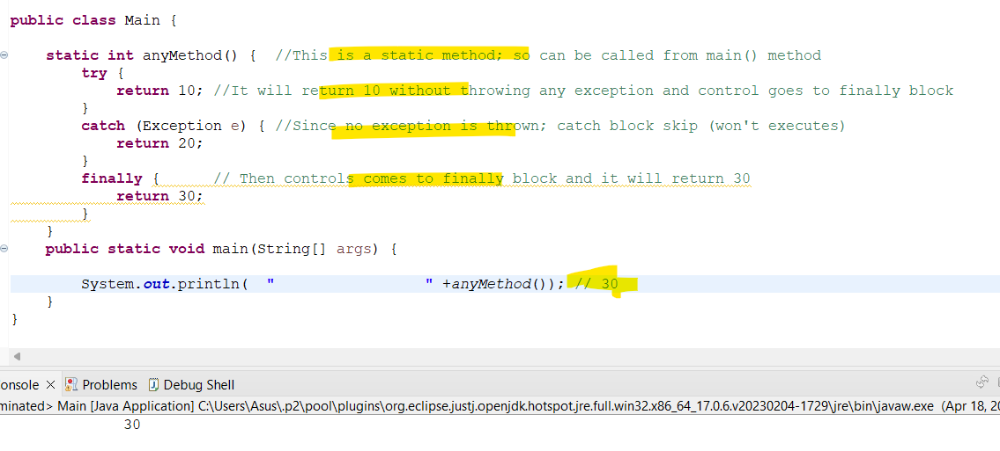
- If finally block contains a return statements it overrides any return values from try and catch block.
## Guess output
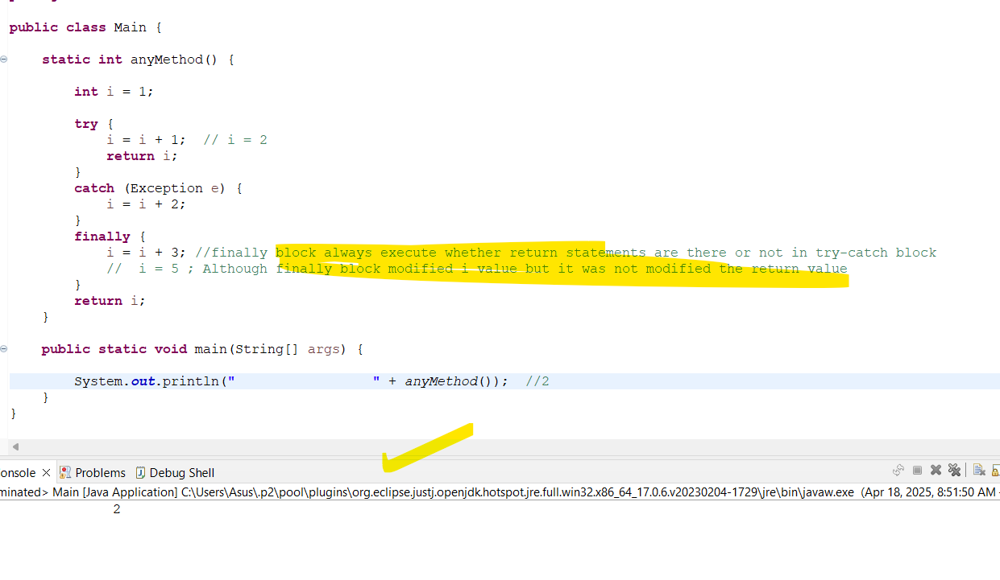
## Guess o/p
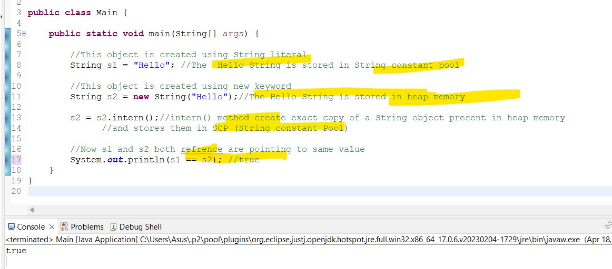
```java
package com.ramesh;

public class Main {

	public static void main(String[] args) {

		//This object is created using String literal
		String s1 = "Hello"; //The  Hello String is stored in String constant pool
		
		//This object is created using new keyword
		String s2 = new String("Hello");//The Hello String is stored in heap memory
		
		s2 = s2.intern();//intern() method create exact copy of a String object present in heap memory
		      //and stores them in SCP (String constant Pool)
		
		//Now s1 and s2 both refrence are pointing to same value
		System.out.println(s1 == s2); //true
	}
}
```
### Guess output
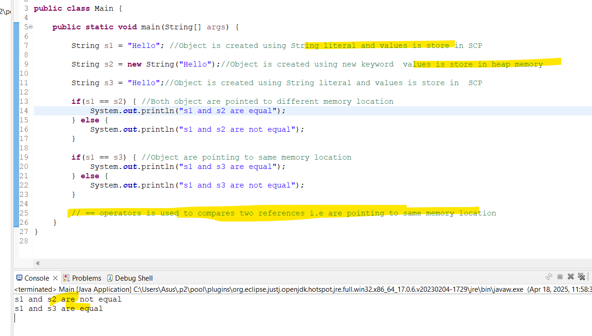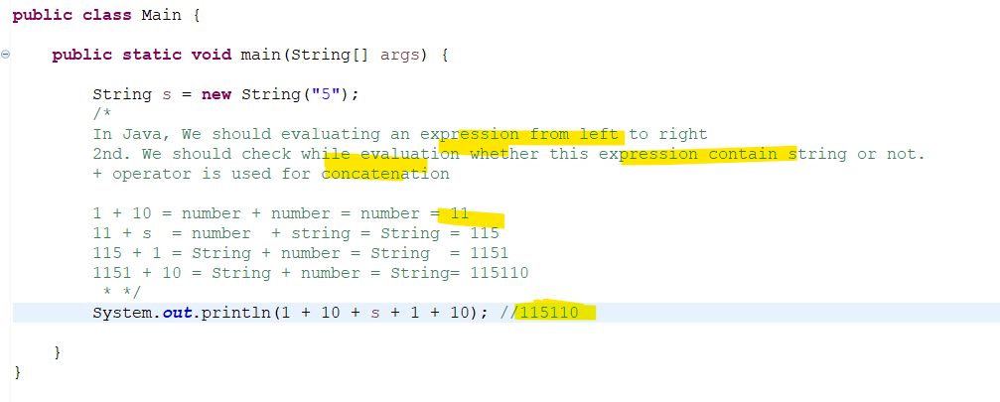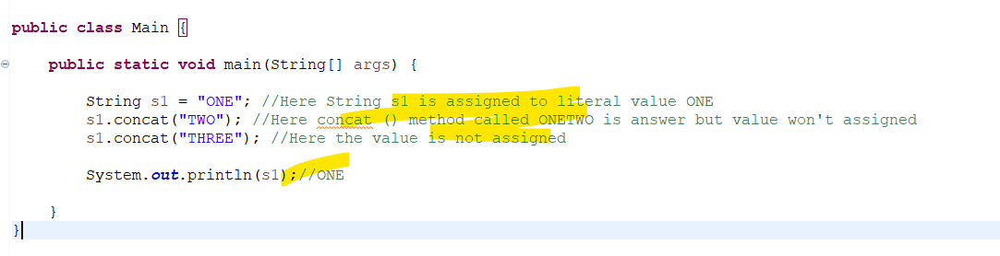
## OOps concept- Guess Output
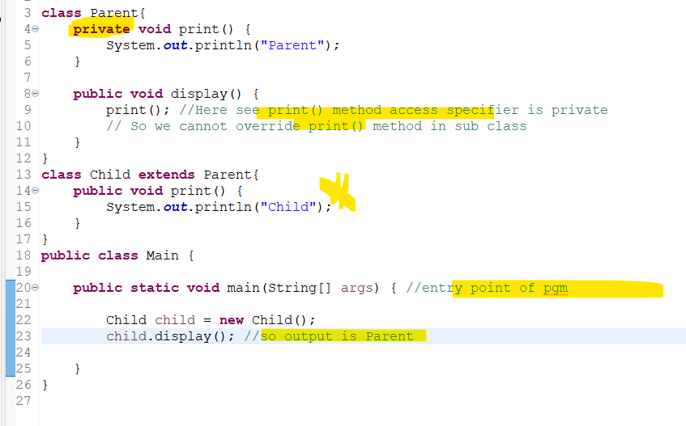
## What happen if you change access specifier from private to public
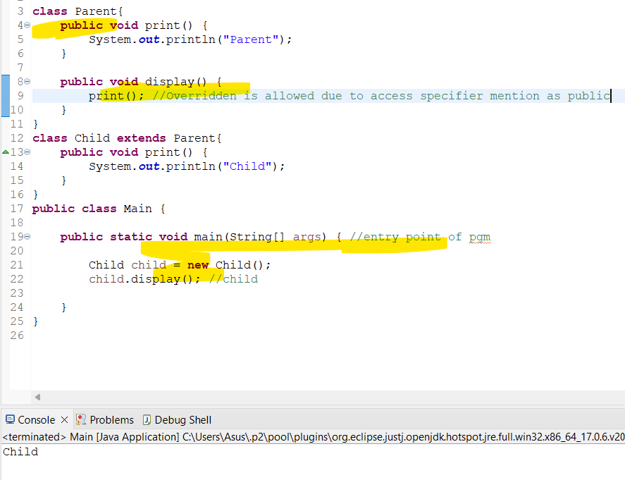
### Remember
- We cannot override the private method in child class
## Guess output
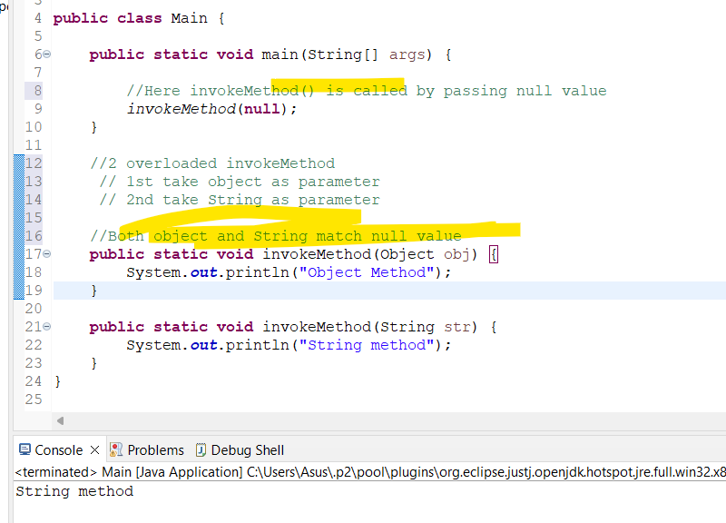
- The java compiler determines the version of invoke-Method to invoke based on argument type.
- Since null can match both object and String 
- The compiler chooses more specific type which is String  in case.
## Guess output
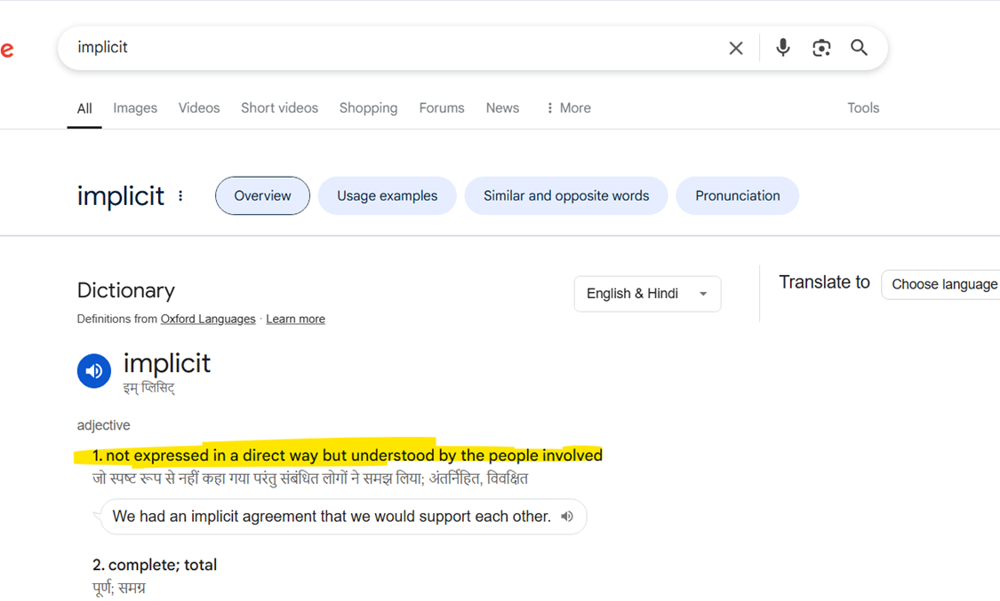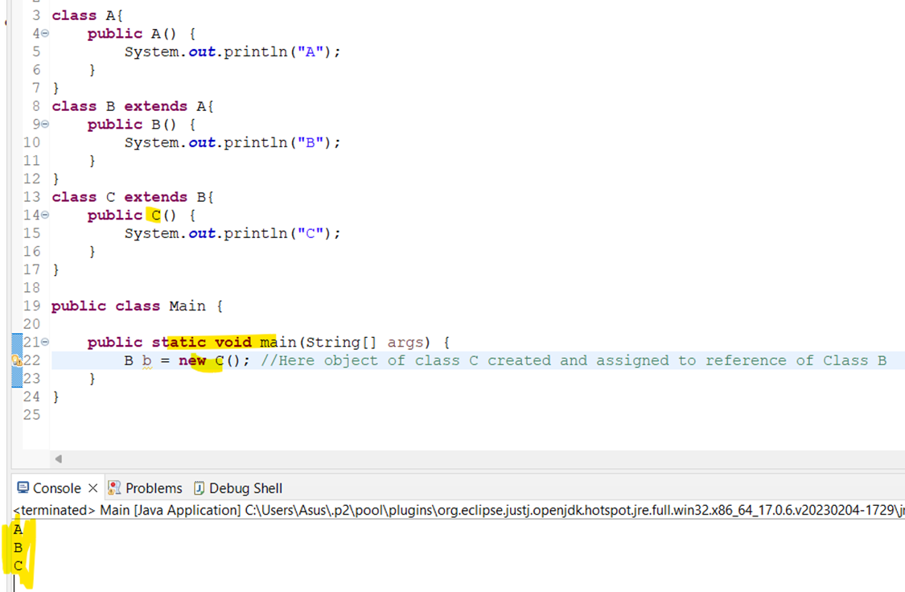
- As soon as the Constructor of class C is invoked, 
- then internally it will call super class constructor as 1st argument by calling super() constructor implicitly.
- this process is repeat till the super most constructor is getting called.
### Remember:
- Each constructor by defualt internally use super() keyword  to call super class constructor
## Guess output
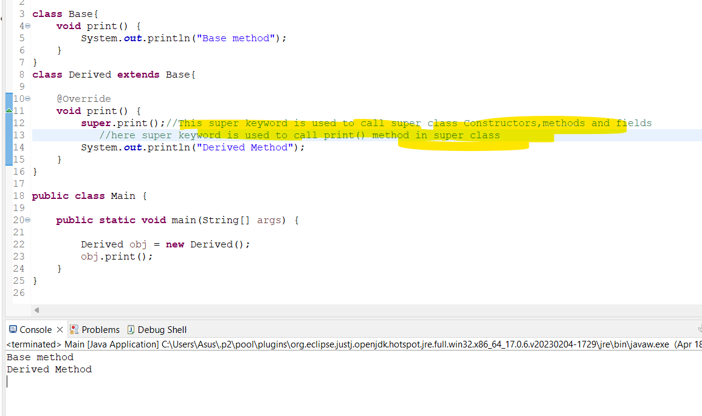
### What happen if you won't provide super keyword in above pgm
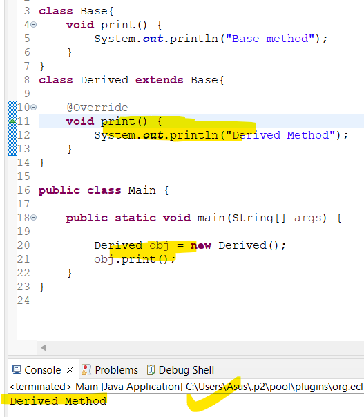
##
### Remember:
- static method are not overriden as instance method.
- here type of refrence variable decide whcih method is getting called (in case of static)
- In case of non-static (calling decide by the type of object creation)

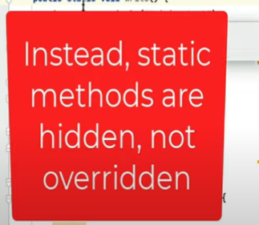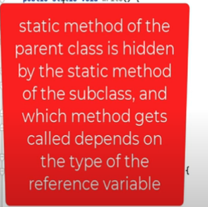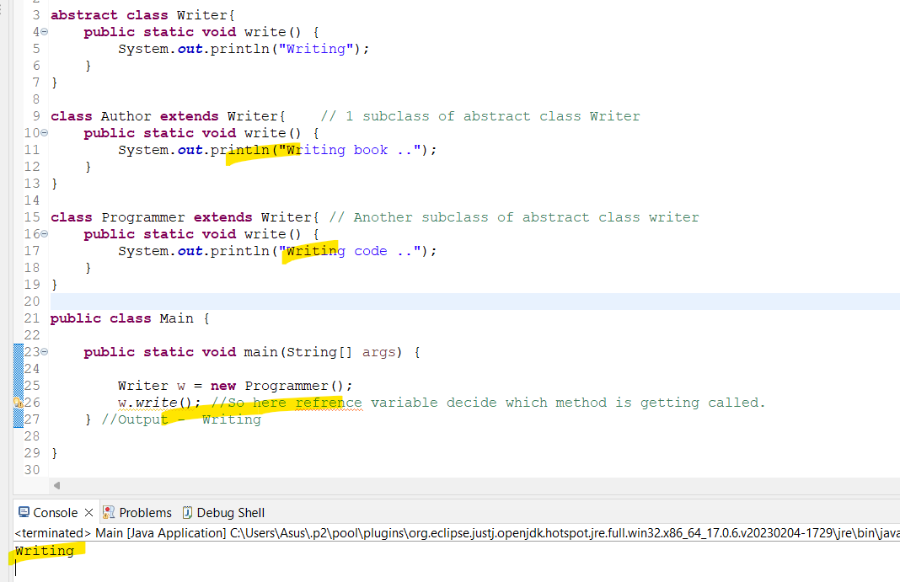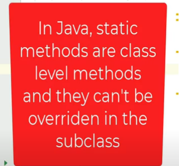


